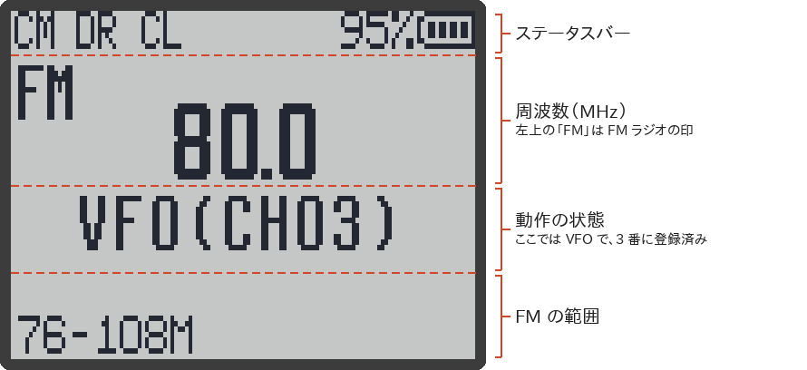
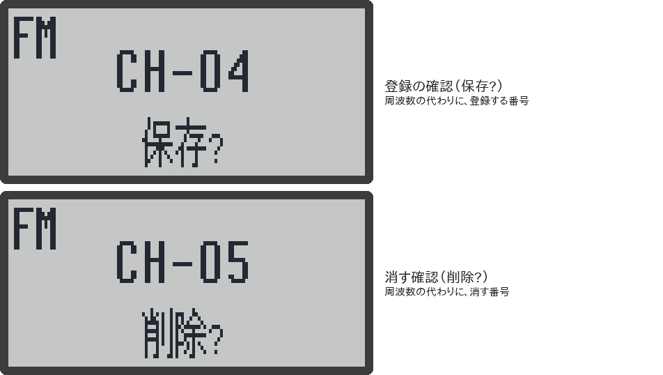

# FMラジオ

この機械では、ふつうの受信とは別に、<strong>FM 放送（76〜108 MHz）</strong>を聞けます。FM 放送用の専用の部品（BK1080）を使っていて、ふだんの受信の周波数とは別に選局します。FM 局は 48 局まで登録できます。

> [!NOTE]
> - このページの内容は、RxJa のソースコードと、元の F4HWN Wiki を読んで確かめたもので、主な動作は実機（UV-K1）でも確かめています。
> - RDS（局名などの文字情報）には対応していません。

## つける・消す

| 操作 | キー |
|---|---|
| FM ラジオをつける | メイン画面で `F` → `0`、または `0` 長押し |
| FM ラジオを消す（メイン画面に戻る） | `EXIT`、`F` → `0`、または `0` 長押し |

サイドキーなどに「FMラジオ」の機能を割り当てていれば、そのキーでもつけたり消したりできます（→ [[キー操作]]）。

- FM ラジオをつけると、スキャン中ならスキャンは止まります。
- ふつうの受信で信号を聞いている最中や、モニター中は、FM ラジオはつきません（エラー音が鳴ります）。
- FM ラジオをつけたまま電源を切ると、次に電源を入れたとき、FM ラジオがつきます。
- FM ラジオを聞いている間は、[[スリープ|画面の見かた#画面が消えたときスリープ]]の節電は働きません。

## 画面の見かた

（画面は、ファームの描画プログラムをそのままパソコンで動かして作ったものです）

| 表示 | 意味 |
|---|---|
| `VFO` | 周波数を直接選ぶモード |
| `VFO(CH03)` | 周波数を直接選ぶモードで、その周波数が 3 番に登録してある |
| `MR(CH05)` | 登録した局を選ぶモードで、いまは 5 番 |
| `M-SCAN` | 局を探している（手動スキャン） |
| `A-SCAN(12)` | 自動スキャンで局を探して登録している。数字は、ここまでに見つかった局の数 |
| `保存?` | 登録の確認中。周波数の代わりに、登録する番号（例：`CH-03`）が出る |
| `削除?` | 登録を消す確認中。周波数の代わりに、消す番号（例：`CH-05`）が出る |
| `76-108M` など（左下） | いま選んでいる FM の範囲（下記） |

登録や削除の確認中は、次のように表示が変わります。

## FM の範囲（バンド）を選ぶ

`F` → `1`、または `1` 長押しで、FM の範囲が次のように切り替わります。

| 表示 | 範囲 |
|---|---|
| `87.5-108M` | 87.5〜108 MHz（外国の FM 放送） |
| `76-108M` | 76〜108 MHz |
| `76-90M` | 76〜90 MHz（日本の FM 放送。ワイド FM は入らない） |
| `64-76M` | 64〜76 MHz（東欧の古い FM 放送） |

周波数の入力、スキャン、登録した局の呼び出しは、**いま選んでいる範囲の中だけ**で働きます。

> [!TIP]
> 日本では **`76-108M`** がおすすめです。日本の FM 放送（76〜90 MHz）と、AM ラジオの番組を FM で流すワイド FM（90〜95 MHz）の両方が入ります。`76-90M` では、ワイド FM が聞けません。

## 周波数を選ぶ（VFO モード）

周波数を直接選ぶモード（画面に `VFO` と出ているとき）では、次のように選局します。

| 操作 | 動き |
|---|---|
| 数字を入れる | その周波数に合わせる。0.1 MHz 単位で、4 けたまで |
| `UP` / `DOWN` | 0.1 MHz ずつ上げる / 下げる（範囲の端まで行くと、反対の端に戻る） |

数字の入れかたの例です。最初の数字が 2〜9 のときは、3 けたで決まります。

| 押すキー | 周波数 |
|---|---|
| `8` `0` `0` | 80.0 MHz |
| `7` `6` `5` | 76.5 MHz |
| `9` `3` `3` | 93.3 MHz |
| `1` `0` `1` `5` | 101.5 MHz |

範囲の外の周波数を入れると、エラー音が鳴って、周波数は変わりません。入れている途中は、`EXIT` で 1 けたずつ消せます。

## 局を探す（スキャン）

### 手動スキャン

`*` を短く押すと、いまの周波数から上に向かって局を探し、**最初に見つかった局で止まります**（画面は `M-SCAN`）。

| 操作 | 動き |
|---|---|
| `UP` / `DOWN` | 探している途中、または止まったあとで、その向きに探し直す |
| `M` | 見つかった局を登録する（下記の「局を登録する」と同じ手順） |
| `*`、`EXIT`、`PTT` | 探すのをやめて、その周波数を聞く |

### 自動スキャン

`F` → `*`、または `*` 長押しで、範囲の下の端から順に局を探し、見つかった局を **1 番から順に登録**していきます（画面は `A-SCAN(数)`）。最後まで探し終わるか、48 局見つかると止まり、登録した局を選ぶモード（MR）の 1 番になります。

> [!WARNING]
> 自動スキャンを始めると、**登録してあった 48 局はすべて消えます**。消したくない局があるときは、手動スキャンを使ってください。

> [!NOTE]
> v0.1.0 では、範囲が `76-90M` か `64-76M` のとき、自動スキャンが範囲の上の端で止まらずに下の端へ戻って探し続け、同じ局を何回も登録してしまう不具合がありました（元の F4HWN にもある不具合です）。**v0.1.1 で直しました。** どの範囲でも、上の端まで探すと止まります（ソースコードで確かめたこと。実機では未確認）。

自動スキャンの途中で `*`、`EXIT`、`PTT` を押すと、そこでやめます（それまでに見つかった局は登録されます）。

### スキャン中のふつうの受信

局を探している間は、ふつうの受信（A/B の周波数）に信号が入っても、探すのをやめません。探し終わると、いつものように、ふつうの受信が優先されます（→ [ふつうの受信との関係](#ふつうの受信との関係)）。

## 局を登録する

周波数を直接選ぶモード（`VFO`）で、登録したい局を聞いているときに行います。

1. `M` を押す。画面に `保存?` と、登録する番号（例：`CH-01`）が出ます。
2. `UP` / `DOWN`、または数字 2 けた（例：`0` `5`）で、登録する番号を選ぶ。
3. もう一度 `M` を押すと登録されます。

やめるときは `EXIT` です。すでに登録のある番号を選ぶと、上書きされます。

手動スキャンで局が見つかって止まったときも、同じように `M` で登録できます。

## 登録した局を聞く（MR モード）

`F` → `3`、または `3` 長押しで、周波数を直接選ぶモード（`VFO`）と、登録した局を選ぶモード（`MR`）が切り替わります。1 局も登録していないときは、MR モードにはなりません（エラー音が鳴ります）。

| 操作 | 動き |
|---|---|
| `UP` / `DOWN` | 次の / 前の登録局 |
| 数字 2 けた | その番号の局（`0` `1`〜`4` `8`）。登録の無い番号はエラー音 |

### 登録を消す

1. MR モードで、消したい局を選んで `M` を押す。画面に `削除?` と番号が出ます。
2. もう一度 `M` を押すと消えます。やめるときは `EXIT` です。

## ふつうの受信との関係

FM ラジオを聞いている間も、ふつうの受信（A/B の周波数）は見張っています。

1. ふつうの受信に信号が入ると、FM ラジオの音は止まり、メイン画面に切り替わって、その信号が聞こえます。
2. 信号が終わって **5 秒**たつと、FM ラジオの画面と音に戻ります。

局を探している（スキャン中の）ときだけは、ふつうの受信に信号が入っても、FM が優先されます。

## FM ラジオの画面で使えるキー

| キー | 動き |
|---|---|
| 数字 | VFO：周波数を入れる。MR：局の番号を入れる。`保存?` のとき：登録する番号を入れる |
| `UP` / `DOWN` | VFO：0.1 MHz ずつ。MR：次 / 前の局。`保存?` のとき：登録する番号。スキャン中：その向きに探し直す |
| `*` | 手動スキャン。スキャン中なら、やめる |
| `M` | VFO：登録（`保存?`）。MR：登録を消す（`削除?`）。手動スキャンで止まったあと：登録 |
| `M` 長押し | 「M長押し」に割り当てた機能 |
| `EXIT` | 入力中は 1 けた消す。確認中（`保存?` / `削除?`）はやめる。スキャン中は、やめて聞く。それ以外は、FM ラジオを消す |
| `F` → `0` / `0` 長押し | FM ラジオを消す |
| `F` → `1` / `1` 長押し | FM の範囲を切り替える |
| `F` → `3` / `3` 長押し | VFO / MR を切り替える |
| `F` → `*` / `*` 長押し | 自動スキャン（登録がすべて消えるので注意） |
| `F` → `8` / `F` → `9` | バックライトを点ける / ふだんの点灯時間に戻す |
| `F` 長押し | キーロック |
| `PTT` | スキャン中なら、やめて聞く。それ以外は、メイン画面に「送信禁止」と出て、2.5 秒ほどで FM ラジオの画面に戻る |
| サイドキー | 割り当てた機能。ただし、FM ラジオの画面では働かない機能や、働きが変わる機能がある（下記） |

`F` → そのほかの数字、`F` → サイドキーは、エラー音が鳴るだけです。

### FM ラジオの画面でのサイドキーの機能

次の機能は、FM ラジオの画面ではエラー音が鳴るだけです。

- モニター、VFO A/B、VFO メモリ、変調切替、受信方式、メインのみ、帯域幅切替、受信音質
- 送信出力（RxJa では、もともと使えません）

フラッシュライト、スキャン、FMラジオ、キーロック、消音、受信ログは、FM ラジオの画面でも使えます。

「スキャン」を割り当てたサイドキーは、FM ラジオの画面では**手動スキャン**になります（`*` の短押しと同じ。スキャン中にもう一度押すと、やめます）。登録してある局は消えません。

> [!NOTE]
> 元の F4HWN と RxJa v0.1.0 では、このサイドキーが**自動スキャン**になり、押すと登録してあった 48 局がすべて消えていました。RxJa v0.1.1 から手動スキャンに変えています。自動スキャンは、`F` → `*` か `*` 長押しで使えます。

## 関連ページ

- [[キー操作]]
- [[画面の見かた]]
- [F4HWN Wiki の FM broadcast radio receiver（英語）](https://github.com/armel/uv-k1-k5v3-firmware-custom/wiki/FM-broadcast-radio-receiver)
