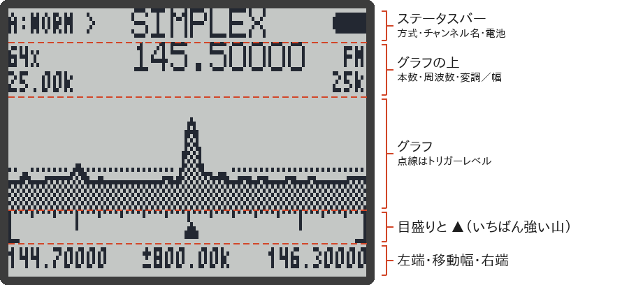
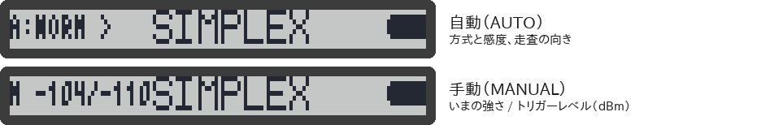

# スペクトラム

スペクトラム（スペクトラムアナライザー）は、周波数の幅を横に並べて、**どこに信号が出ているかをグラフで見る**機能です。横軸が周波数、縦軸が信号の強さです。信号が出ると、そこが山になって、その音も聞こえます。

スキャンが「1 つずつ順に聞いていく」のに対して、スペクトラムは「広い範囲をまとめて眺める」使い方です。

> [!NOTE]
> - スペクトラムの画面は**英語のまま**です（日本語にはなっていません）。このページで、表示の意味を説明します。
> - このページの内容は、RxJa のソースコードと、元の F4HWN Wiki を読んで確かめたもので、主な動作は実機（UV-K1）でも確かめています。
> - スペクトラムの画面でも、PTT を押して送信することはありません（→ [PTT](#詳細モニター)）。

## 開き方と閉じ方

| 操作 | キー |
|---|---|
| 開く | メイン画面で `F` → `5` |
| 閉じる（設定を保存してメイン画面に戻る） | `EXIT` |

- 開いたときは、メインの段（`▶` の付いたほう）の周波数が、グラフの**まん中**になります。
- 範囲スキャンのモード（周波数モードで `5` 長押し。→ [[スキャン#範囲スキャン]]）のまま開くと、**その範囲**がグラフの左端から右端になります。
- スペクトラムを開いたまま電源を切ると、次に電源を入れたとき、スペクトラムが開きます（→ [[スキャン#電源を切ったときのスキャン]]）。

> [!IMPORTANT]
> スペクトラムの画面では、**キーロックが効きません**。ポケットの中などでキーが押されないよう、使い終わったら `EXIT` で閉じてください。

## 画面の見かた

（画面は、ファームの描画プログラムをそのままパソコンで動かして作ったものです）

### ステータスバー（いちばん上）

| 表示 | 意味 |
|---|---|
| `A:NORM >` など | <strong>自動（AUTO）</strong>の方式で動いている。`WEAK` / `NORM` / `STRG` は感度（下の表）。`>` は周波数の低いほうから高いほうへ、`<` は高いほうから低いほうへ走査中 |
| `M -95/-110` など | <strong>手動（MANUAL）</strong>の方式で動いている。いまの信号の強さ（dBm） / トリガーレベル（dBm）。`--` は、まだ値がないこと（モニター中はトリガーも `--`） |
| チャンネル名 | 信号を聞いているとき、その周波数が登録したチャンネルと同じなら、その名前（日本語の名前は行が低くて入らないので出ません） |
| 右端 | 電池の残り |

### グラフの上

| 表示 | 意味 |
|---|---|
| `64x`（左） | グラフの本数（何ステップ分を並べているか）。`4` で `128x` → `64x` → `32x` → `16x` と切り替わる |
| `145.50000`（まん中） | いちばん強い山の周波数（聞いているときは、その周波数） |
| `FM`（右） | 変調（FM / AM / USB）。`0` で切り替わる |
| `25.00k`（左の 2 行目） | 1 本あたりの周波数の幅（kHz）。`1` / `7` で変わる |
| `25k`（右の 2 行目） | 信号を聞くときの帯域幅（`25k` / `12.5k` / `6.25k`）。`6` で切り替わる |

### グラフの下

| 表示 | 意味 |
|---|---|
| `▲`（グラフのすぐ下） | いちばん強い山の位置 |
| 左・右 | グラフの左端と右端の周波数 |
| まん中（`±` 付き） | `UP` / `DOWN` でグラフを動かすときの幅。範囲スキャンのモードで開いたときは、`±` の無い数字で、範囲の幅 |

1 本の幅が 2.5 kHz より細かいときは、下の段は「まん中の周波数」と「`±` 動かす幅」の 2 つだけになります。

## 自動（AUTO）と手動（MANUAL）

信号が入ったと判断する強さ（**トリガーレベル**）の決め方が、2 とおりあります。`M` を短く押すと切り替わります。

| 方式 | 動き | 向いているとき |
|---|---|---|
| 自動（`A:`） | まわりの雑音の強さを測って、それより少し強い信号が来たら止まる | ふだんはこちら |
| 手動（`M`） | 自分で決めた強さ（トリガーレベル）より強い信号が来たら止まる | 雑音が多くて、自動ではうまく止まらないとき |

自動のときの感度は、`3` / `9` で選びます。

| 感度 | 雑音より何 dB 強ければ止まるか | 特徴 |
|---|---|---|
| `WEAK` | +12 dB | いちばん鈍い。雑音で止まりにくい |
| `NORM` | +8 dB | 標準 |
| `STRG` | +5 dB | いちばん敏感。弱い信号でも止まる |

手動のときは、次のキーで調整します。

| キー | 動き |
|---|---|
| `*` / `F` | トリガーレベルを 1 dB 上げる / 下げる |
| `3` / `9` | グラフの縦の目盛りの上限（dBmax）を 5 dB 上げる / 下げる |

自動のときも `*` / `F` でトリガーレベルを動かせますが、少しずつ自動の値に戻っていきます。縦の目盛りも、自動のときは、信号の強さに合わせて自動で変わります。

> [!TIP]
> 雑音ばかりで止まるときは、手動にして、`*` でトリガーレベルを雑音の山より少し上に合わせてください。

## キー操作（グラフの画面）

| キー | 動き |
|---|---|
| `UP` / `DOWN` | グラフ全体を、周波数の上 / 下へ動かす。信号を聞いているときは、その信号を離れて、その向きへ走査を続ける |
| `1` / `7` | 1 本あたりの幅を広く / 狭く（0.01〜100 kHz） |
| `2` / `8` | `UP` / `DOWN` で動かす幅を大きく / 小さく |
| `4` | 本数を切り替える（128 / 64 / 32 / 16） |
| `5` | 周波数を入力する（下記） |
| `0` | 変調を切り替える（FM / AM / USB） |
| `6` | 聞くときの帯域幅を切り替える |
| `3` / `9` | 自動：感度を切り替える。手動：縦の目盛りの上限を上げる / 下げる |
| `*` / `F` | トリガーレベルを上げる / 下げる |
| `M` | 自動 / 手動を切り替える |
| `M` 長押し | スペクトラムの設定を**初期値に戻して保存する**（64 本・25 kHz・帯域幅 25k・自動・NORM。周波数と範囲はそのまま） |
| サイドキー 1 | いま山になっている周波数を**除外**する（グラフから外して、止まらないようにする）。最大 15 個まで。超えると古いものから忘れる |
| サイドキー 2 | バックライトの点灯 / 消灯 |
| `PTT` | いちばん強い山の周波数に合わせて、[詳細モニター](#詳細モニター)を開く |
| `EXIT` | 設定を保存して、メイン画面に戻る |

- 範囲スキャンのモードで開いたときは、`UP` / `DOWN`、`4`、`5` は使えません（範囲が決まっているため）。
- サイドキー 1・2 は、ふだん割り当てた機能ではなく、上の表の動きになります。
- 除外は、グラフを動かす・周波数を入れる・幅や本数や変調を変える・`M` 長押しで初期値に戻す、のどれかで、すべて取り消されます。

### 周波数の入力

1. `5` を押すと、画面の上に入力欄が出ます。
2. 数字で周波数を MHz で入れる。小数点は `*`（例：`4` `3` `3` `*` `5` = 433.5 MHz）。
3. `M` で決定。`EXIT` は 1 けた消す（空のときに押すと、入力をやめる）。

グラフの画面では、入れた周波数が**グラフの左端**になります（1 本の幅が 2.5 kHz より細かいときは、グラフのまん中）。詳細モニターの画面では、その周波数に移ります。

入れられるのは、この機械が受信できる周波数の範囲だけです。範囲の外の数字では、`M` を押しても決まりません。

## 詳細モニター

グラフの画面で `PTT` を押すと、いちばん強い山の周波数に合わせて、**詳細モニター**の画面になります。1 つの周波数をじっくり聞き、信号の強さを大きく表示する画面です。

> [!NOTE]
> スペクトラムの画面の `PTT` は、詳細モニターを開くだけです。電波は出ません。

画面には、周波数、`S: 7` のような S メーター、`-85 dBm` のような信号の強さ、トリガーレベルの印、受信部の増幅の設定（`LNAs` / `LNA` / `PGA`）が出ます。

| キー | 動き |
|---|---|
| `UP` / `DOWN` | 周波数を少しずつ上下（FM は 1 kHz、AM は 0.5 kHz、USB は 0.1 kHz ずつ）。`M` で増幅の設定を選んでいるときは、その値を上下 |
| `5` | 周波数を入力する（入れた周波数に移る） |
| サイドキー 1 | モニター（スケルチを開けて、信号が無くても雑音ごと聞く）の ON / OFF |
| `M` | 増幅の設定（`LNAs` → `LNA` → `PGA`）を順に選ぶ |
| `EXIT` | 増幅の設定を選んでいるときは、選ぶのをやめる。それ以外は、グラフの画面に戻る |
| `0`、`6`、`3` / `9`、`*` / `F`、サイドキー 2 | グラフの画面と同じ |

`LNAs` / `LNA` / `PGA` は、受信部の増幅の強さです（dB で表示）。強い信号でひずむときに下げると、聞きやすくなることがあります。**この値は保存されません**（閉じると元に戻ります）。

## 保存される設定

グラフの画面で `EXIT` を押して閉じると、次の設定が保存され、次に開いたときに使われます。

| 保存される | 保存されない |
|---|---|
| 1 本あたりの幅（`1` / `7`） 本数（`4`） 聞くときの帯域幅（`6`） 自動 / 手動（`M`） 自動の感度（`3` / `9`） 縦の目盛りの上限（dBmax） トリガーレベル | グラフの位置（開くたびに、メインの段の周波数がまん中になる） 動かす幅 変調（開くたびに、メインの段の変調になる） 除外した周波数 詳細モニターの増幅の設定 |

詳細モニターの画面にいるときは、`EXIT` を 2 回押してください（1 回目でグラフの画面に戻り、2 回目で保存して閉じます）。

## 関連ページ

- [[スキャン]]
- [[キー操作]]
- [[画面の見かた]]
- [F4HWN Wiki の Spectrum analyzer（英語）](https://github.com/armel/uv-k1-k5v3-firmware-custom/wiki/Spectrum-analyzer)
