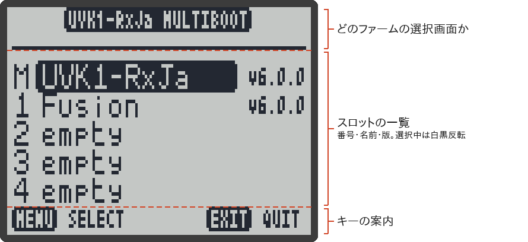

# マルチブート

マルチブートは、**無線機の中に最大 5 つのファームを入れておいて、電源を入れるときに選ぶ**機能です。元の F4HWN（v6.0.0 から）の機能で、RxJa でもそのまま使えます。

あわせて、ファームごとに**チャンネルや設定を別々に持つ**しくみ（マルチコンフィグ）もあります。別のファームを試しても、RxJa のチャンネルや設定は書き換わりません。

> [!NOTE]
> - 無線機のマルチブートの画面は**英語のまま**です（日本語にはなっていません）。このページで、表示の意味を説明します。
> - このページの内容は、RxJa のソースコードと、元の F4HWN Wiki を読んで確かめたものです。RxJa の主な動作は実機（UV-K1）で確かめていますが、RxJa Tools でのスロットへの書き込みは、実機ではまだ確かめていません。

> [!CAUTION]
> <strong>送信を止めているのは RxJa だけです。</strong>スロットに元の F4HWN（Fusion など）や、ほかのファームを入れて切り替えると、**その無線機は送信できる状態になります**。
>
> 技適のない無線機から電波を出すのは電波法違反です。RxJa 以外のファームに切り替えたときも、`PTT` は押さないでください。送信できるファームをスロットに入れておくこと自体をおすすめしません。

## スロットのしくみ

| 画面の表示 | 中身 | 入れかた |
|---|---|---|
| `M` | **Main**。ふつうの手順（→ [[ファームの書き込み]]）で書き込んだファームの、自動のバックアップ | 自動 |
| `1`〜`4` | 追加のファーム | RxJa Tools の「ファームスロット」で入れる（下記） |

- ファームが実際に動くのは、無線機の中の「内蔵フラッシュ」です。スロットは、外付けのフラッシュに置いてある**控え**です。
- 起動のときにスロットを選ぶと、その控えが内蔵フラッシュに書き写されて、そのファームで起動し直します。
- ふつうの手順でファームを書き込んだあとの最初の起動では、画面に `Init Main` と出て、いま書き込んだファームが `M` にコピーされます。**終わるまで電源を切らないでください。**
- スロットに入れられるのは、1 つ **118 KiB**（120,832 バイト）までです。RxJa（`f4hwn.rxja.bin`、v1.2.0 で 108,952 バイト）は入ります。

> [!IMPORTANT]
> スロットに入れてよいのは、**マルチブートに対応した F4HWN v6.0.0 以降**のファームだけです。v5.x や純正ファームなどを入れて切り替えると、動くことは動きますが、**起動時の選択画面が出なくなり、ほかのスロットに戻れません**。そうなったら、ふつうの手順で RxJa を書き込み直してください（→ [[ファームの書き込み]]）。

## ファームをスロットに入れる

スロットへの書き込みは、ブラウザのツール「RxJa Tools」（https://dosei.github.io/uvk1-japanese/tools/）の **ファームスロット** の画面で行います。RxJa Tools は、UV Studio を RxJa 用に改変したもので、画面は日本語です（→ [[UV-Studio]]）。

1. 無線機を、ふつうに（`PTT` を押さずに）RxJa で起動する。スロットに書き込むには、マルチブートに対応したファーム（RxJa・Fusion など）が動いている必要があります。
2. パソコンのブラウザ（Chrome / Edge / Opera、または Firefox 151 以降）で [RxJa Tools のファームスロット](https://dosei.github.io/uvk1-japanese/tools/#firmware-slots)を開く（Safari やスマホでは使えません）。
3. **スロットを再読み込み** を押して、無線機のポートを選ぶ。スロット `1`〜`4` の表（エディション・バージョン・サイズ・状態）が出ます。
4. 入れたいファームを選ぶ。
   - 一覧「**マルチブート対応ファームウェア**」から選ぶ。**RxJa（受信専用・日本語）** の各版も、元の F4HWN の v6 系も、ここから選べます。
   - または、「またはパソコン内のファイルを使う」で、パソコンにある `.bin` ファイルを選ぶ。
5. 「**書き込み先スロット**」（`1`〜`4`）を選ぶ。「**表示名**」も変えられます。
6. **スロットに書き込む** を押して確認すると、消去・書き込み・照合が進みます。終わるまで待ってください。

> [!IMPORTANT]
> **スロットに書き込むのはファームだけです。日本語データ（`ja_res.bin`）は書き込まれません。**
>
> - 日本語データは、全スロット共通の場所に 1 つだけ置かれます（下の「RxJa の日本語データとマルチブート」）。
> - 本体に一度書いてあれば、スロットに入れた RxJa でもそのまま使えます。
> - まだ書いていないときは、スロットの RxJa に切り替えて起動してから、RxJa Tools の「**日本語データ**」の画面で書き込んでください（→ [[日本語データの転送]]）。**書くまでは英語表示で動きます。**

- スロットに入れただけでは、いま動いているファームは**変わりません**。切り替えるのは、次の「起動するファームを選ぶ」の操作をしたときです。
- `M` には RxJa Tools から書き込めません（ふつうの手順で書き込んだファームが、自動で入ります）。
- 表の各行の **ファーム消去** で、スロットのファームを消せます。そのスロットの設定の組（下記）は消えません。

> [!TIP]
> RxJa の新しい版を試したいときは、スロット `1` に新しい版を入れて切り替えると、いつもの `M`（古い版）にいつでも戻れます。ただし、スロット `1` のファームは、ふつうは設定の組 `CFG 1`（最初は空っぽ）を使います。いつものチャンネルで試したいときは、下の「設定の組を切り替える（設定切替）」で `CFG M` を選んでください。

## 起動するファームを選ぶ

1. 電源を切る。
2. **`M` だけを押したまま**、電源を入れる（`PTT` は押さない）。
3. 画面の上に **`UVK1-RxJa MULTIBOOT`** と出て `Release keys` と表示されたら、`M` を放す。
4. `Scanning slots...` / `Please wait` のあいだ、スロットの中身を確かめています。少し待ちます。
5. スロットの一覧が出ます。`UP` / `DOWN` で選ぶ（UV-K1 では左右に並んだキー。向きはメニューの「矢印操作（SetNav）」に従います。→ [[キー操作]]）。
6. `M` を押すと、`Restore Main?` や `Restore slot 1?` と確認が出ます。
7. **もう一度 `M`** を押すと、書き写しが始まります。画面に `Writing / Verify` と `DO NOT POWER OFF` が出て、下の横棒が伸びていきます。
8. 終わると、自動で再起動して、選んだファームで起動します。

> [!WARNING]
> `DO NOT POWER OFF` の表示中は、内蔵フラッシュを書き換えています。<strong>ここで電源を切ると、無線機が起動しなくなるおそれがあります。</strong>そうなったら、ふつうの手順（DFU モード。RxJa Tools の画面では「書き込みモード」）でファームを書き込み直してください（→ [[ファームの書き込み]]）。

### 選択画面の見かた

（画面は、ファームの描画プログラムをそのままパソコンで動かして作ったものです）

| 表示 | 意味 |
|---|---|
| `M`、`1`〜`4`（左） | スロットの番号 |
| 名前（まん中） | スロットのファームの名前（RxJa Tools でつけた表示名など）。RxJa のスロットは `UVK1-RxJa`（v0.1.2 までは `RxJa`） |
| `v6.1.0` など（右） | ファームの版。RxJa のスロットには、もとにした F4HWN の版（`v6.1.0`）が出ます。RxJa 自体の版（`v0.1.0` など）は[本体情報](メニュー一覧#本体情報sysinfのページ)で見られます |
| `empty` | 空のスロット |
| `incomplete` | 書き込みが途中で止まっている |
| `bad size` | 大きさがおかしい（118 KiB を超えている など） |
| `CRC ERROR` | 中身が壊れている |
| `new header` | 管理情報の形式が、いま動いているファームと合わない（別の版の形式で書かれている） |
| `SPI ERROR` | 外付けフラッシュを読めなかった |
| `MENU SELECT` / `EXIT QUIT` | `M` で選ぶ / `EXIT` でやめる |

- 最初は、**いま動いているファームの元になったスロット**が選ばれています。
- 名前の代わりに `empty` などが出ているスロットは、選んでも `SLOT NOT VALID` と出るだけで、切り替わりません（何かキーを押すと一覧に戻ります）。

### やめるとき

| 画面 | キー | 動き |
|---|---|---|
| スロットの一覧 | `EXIT` | 何も変えずに、いまのファームでふつうに起動する |
| 確認（`Restore ...?`、`MENU CONFIRM` / `EXIT BACK`） | `M` 以外のキー | 一覧に戻る |

### `M`（いつもの RxJa）に戻る

別のスロットのファームに切り替えたあと、いつもの RxJa に戻すときも、同じ手順です。`M` を押したまま電源を入れて、一覧で `M` を選び、`M` → `M` と押します。

## 設定の組（マルチコンフィグ）

チャンネル・チャンネル名・VFO・スキャンリスト・メニューの設定などは、<strong>設定の組（CFG）</strong>ごとに別々に保存されます。組は `CFG M` と `CFG 1`〜`CFG 4` の 5 つです。

ふつうは、スロットと同じ番号の組が使われます。

| ファーム | 使う設定の組 |
|---|---|
| `M`（Main） | `CFG M` |
| スロット `1` | `CFG 1` |
| スロット `2` | `CFG 2` |
| スロット `3` | `CFG 3` |
| スロット `4` | `CFG 4` |

まだ一度も使っていない組は、最初に使ったときに初期値から始まります。

次のものは組ごとに分かれておらず、**すべてのファームで共通**です。

- 較正データ（無線機ごとの調整値）
- 起動画面の画像
- マルチブートの管理情報
- 受信ログ（→ [[受信ログ]]）
- **RxJa の日本語データ**（下記）

### 設定の組を切り替える（設定切替）

ファームはそのままで、別の組の設定を使うこともできます。

1. メニューの「設定切替（`SetCfg`）」を開く（→ [[メニュー一覧]]）。
2. `CFG M`、`CFG 1`〜`CFG 4` から選ぶ。
3. `M` を押すと `実行する?` と出るので、もう一度 `M` を押す。
4. **その場で設定が切り替わり**、メイン画面に戻ります（v1.2.0 から。v1.1.0 までは再起動していました）。

- いま使っている組を選んだときは、何も起きません。
- いま使っている組は、ステータスバーの左端に `CM` / `C1`〜`C4` で出ます（→ [[画面の見かた#ステータスバー]]）。
- 切り替えると、FM ラジオは消えます。
- 切り替えに失敗したときは、`CFG ERROR` と出ます。何かキーを押すと戻ります（設定の組は変わりません）。
- いまの組み合わせは、メニューの「本体情報（`SysInf`）」の最初のページに、`SLOT x`（いま動いているファームの元のスロット）と `CFG x`（いま使っている設定の組）で出ます。

> [!CAUTION]
> 設定切替では、**別のファームや別の版の設定を読み込めてしまいます**。ファームによって設定の中身の並びが違うと、設定がおかしくなることがあります。大事なチャンネルは、先に CHIRP でパソコンに保存しておいてください（→ [[CHIRP]]）。

### 設定の組を消す

- メニューの「初期化（`Reset`）」で消えるのは、**いま使っている組だけ**です（→ [[メニュー一覧]]）。
- RxJa Tools の「ファームスロット」の表の各行の **設定を初期化** で、`CFG 1`〜`CFG 4` の組を消せます（ファームは消えません）。`CFG M` は消せません。

## RxJa の日本語データとマルチブート

日本語データは、外付けフラッシュの 0x122000〜0x14BFFF に置いています。ここは、スロットにも設定の組にも重なりません（→ [[日本語データの転送]]）。

- スロットを切り替えても、日本語データは消えません。
- RxJa をスロット `1`〜`4` に入れて起動しても、同じ日本語データを使います。**スロットごとに転送し直す必要はありません。**
- 逆に、スロットに書き込んでも日本語データは書かれません。本体にまだ日本語データが無いときは、スロットの RxJa で起動してから「日本語データ」の画面で書き込んでください（上の「ファームをスロットに入れる」の注意）。
- 元の F4HWN v6.1.0 は、この場所を使っていません（ソースコードで確認）。そのため、元の F4HWN に切り替えて、また RxJa に戻っても、日本語データは残っているはずです。

> [!NOTE]
> ほかのファームや、元の F4HWN の今後の版が、この場所を使うようになるかもしれません。RxJa に戻したときに文字化けしたり、日本語が出なくなったりしたら、日本語データを転送し直してください（→ [[日本語データの転送]]）。

## ふつうの手順で書き込んだとき

RxJa Tools の **ファーム書き込み** など、DFU モードで（→ [[ファームの書き込み]]）ふつうにファームを書き込むと、次のようになります。

- 次の起動で、書き込んだファームが新しい `M` になります（`Init Main`）。それまで `M` にあったファームは、**上書きされて消えます**。
- 設定の組は `CFG M` に戻ります。
- スロット `1`〜`4` のファームと、`CFG 1`〜`CFG 4` の設定は、そのまま残ります。

> [!TIP]
> いまの `M` のファームを残しておきたいときは、ふつうの手順で別のファームを書き込む前に、そのファームをスロット `1`〜`4` のどれかに入れておいてください。

## 困ったとき

| 画面 | 意味と対処 |
|---|---|
| `STATE ERROR` / `Flash state unknown` / `Restart radio` | どのファーム・どの組を使えばよいか読み取れず、安全のため止まっています。電源を入れ直してください |
| `STATE ERROR` / `Marker not saved` | 切り替えの準備に失敗しました。何かキーを押すと一覧に戻ります（切り替えは行われていません） |
| `RESTORE REFUSED` | 書き写す直前の確認で、スロットの中身がおかしいとわかったため、やめました。いまのファームは消えていません |
| `SLOT NOT VALID` | 空か、壊れたスロットを選びました |
| 選択画面が出ない | `M` だけを押したまま電源を入れているか確かめてください（`PTT` も押していると出ません）。マルチブート非対応のファームに切り替えたあとは出ません（上の「スロットのしくみ」の注意） |

ほかの困りごとは [[トラブルシューティング]] を見てください。

## 関連ページ

- [[ファームの書き込み]]
- [RxJa Tools のファームスロット](https://dosei.github.io/uvk1-japanese/tools/#firmware-slots)
- [[UV-Studio]]
- [[日本語データの転送]]
- [[受信専用のしくみ]]
- [[メニュー一覧]]
- [F4HWN Wiki の Multiboot and Multiconfig（英語）](https://github.com/armel/uv-k1-k5v3-firmware-custom/wiki/Multiboot-and-Multiconfig)
