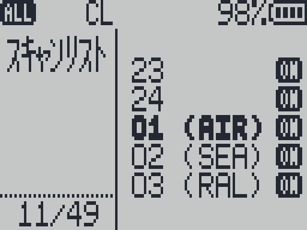
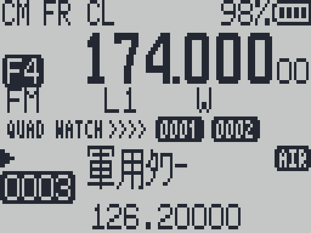

# メニュー一覧

RxJa のメニューは全部で **53 項目**です。ふだん見えるのが 49 項目で、残りの 4 項目は「隠しメニュー」です（→ [隠しメニュー](#隠しメニュー保守)）。送信のときだけ使う 24 項目は、はじめから入っていません（→ [[受信専用のしくみ]]）。

このページの項目名は「**日本語名（英語名）**」の形で書いています。英語名は、日本語データを入れていないときの表示や、F4HWN の英語の説明と見比べるときに使ってください。

## メニューの操作

### 開く・閉じる

| 操作 | 動き |
|---|---|
| `M` | メニューを開く。最初は**カテゴリの画面**（チャンネル、スキャン、キー…）が出ます |
| `EXIT` | ひとつ前の画面に戻る（値の編集 → 項目の一覧 → カテゴリの画面 → 通常の画面） |
| 何もしないで 20 秒 | 通常の画面に戻る（「音量（SetVol）」と「電池校正（BatCal）」の編集中は 2 分） |

スキャン中に `M` を押すと、メニューは開かずにスキャンが止まります（→ [[スキャン]]）。

### カテゴリの画面

カテゴリの名前と、中に入っている項目の数が並びます。

| 操作 | 動き |
|---|---|
| `UP` / `DOWN` | カテゴリを選ぶ |
| `M` | そのカテゴリの項目一覧に入る |
| 数字 1〜2 桁 | 「すべて」の中の、その番号の項目へ直接飛ぶ（番号はこのページの表の「番号」） |

前に開いていた項目の位置は、カテゴリごとに覚えています。

### 項目の一覧と値の変更

| 操作 | 動き |
|---|---|
| `UP` / `DOWN` | 項目を選ぶ |
| 数字 2 桁 | いま開いているカテゴリの、その順番の項目へ飛ぶ |
| `M` | 値の編集に入る（値が反転表示になる） |
| `UP` / `DOWN`（編集中） | 値を変える |
| 数字（編集中） | 数値の項目は、数字で直接入力できる |
| `M`（編集中） | 決定して保存 |
| `EXIT`（編集中） | 取り消し（変更前の値のまま） |

> [!NOTE]
> UV-K1 は矢印キーが左右に並んでいます。値を変えるときの向きは、隠しメニューの「矢印操作（SetNav）」で入れ替えられます（→ [[キー操作]]）。

一部の項目（チャンネルの保存・削除・名前、設定切替、初期化）は、`M` で決めたあとに **`実行する?`**（SURE?）と確認が出ます。もう一度 `M` で実行、`EXIT` でやめます。

### 値の変更がすぐ見える項目

「照明最小（BLMin）」「照明最大（BLMax）」「画面濃度（SetCtr）」「白黒反転（SetInv）」は、値を選んでいるあいだ、その場で明るさ・濃さ・反転が変わります。見ながら合わせて、`M` で決定してください。

## カテゴリ

| カテゴリ | 入っている項目 |
|---|---|
| チャンネル | ステップ、DCS、CTCSS、帯域幅、狭帯域、ｺﾝﾊﾟﾝﾀﾞ、変調、CH一覧、CH保存、CH削除、CH名称、設定切替 |
| スキャン | ｽｷｬﾝﾘｽﾄ、SC優先、優先CH1、優先CH2、SC再開、SC速度 |
| キー | F1短押、F1長押、F2短押、F2長押、M長押、自動ﾛｯｸ、ﾛｯｸ対象、1コール |
| 電源 | 省電力、電池表示、自動OFF、省電画面 |
| 表示 | CH表示、起動表示、照明時間、照明最小、照明最大、受信ﾗｲﾄ、画面濃度、白黒反転、Sﾒｰﾀｰ、画面様式、本体情報 |
| タイマー | タイマー |
| 音声 | 操作音、音量、受信音質 |
| 無線 | スケルチ、SQﾃｰﾙ消、受信方式 |
| DTMF | DTMF |
| 保守 | 電池校正、電池種類、矢印操作、初期化（隠しメニューを出したときだけ） |
| すべて | 全項目を、下の表の番号の順に |

## 全項目の一覧

「番号」は「すべて」の中での順番で、カテゴリの画面から数字で飛ぶときに使います。

説明の最後の「**デフォルト値**」は、隠しメニューの「初期化（Reset）」で `ALL` を選んだあとの値です（ファームのソースから確かめた値）。ファームを書き込んだだけでは前の設定が残っていることがあるので、いまの値がこのとおりとは限りません。ステップ〜CH一覧（1〜7 番）は、チャンネルごとの設定なので、初期化したあとの周波数モード（VFO）の値を書いています。

### チャンネル・受信の設定

| 番号 | 日本語名（英語名） | 選択肢 | 説明 |
|---|---|---|---|
| 1 | ステップ（`Step`） | 0.01 / 0.05 / 0.1 / 0.25 / 0.5 / 1 / 1.25 / 2.5 / 5 / 6.25 / 8.33 / 9 / 10 / 12.5 / 15 / 20 / 25 / 30 / 50 / 100 / 125 / 200 / 250 / 500 kHz | 周波数モード（VFO）で `UP` / `DOWN` を押したときに変わる幅。エアバンドは 8.33 か 25、アマチュア無線の FM は 5〜20 などが目安 デフォルト値：12.5 kHz |
| 2 | DCS（`RxDCS`） | OFF / D023N〜D754N / D023I〜D754I | 受信の DCS（デジタルのトーンスケルチ）。このコードの信号のときだけ音が出る。`N` はふつう、`I` は反転 デフォルト値：OFF |
| 3 | CTCSS（`RxCTCS`） | OFF / 67.0Hz〜254.1Hz | 受信の CTCSS（トーンスケルチ）。このトーンの信号のときだけ音が出る デフォルト値：OFF |
| 4 | 帯域幅（`W/N`） | 広帯域 / 狭帯域 | 受信の帯域。アマチュア無線の FM やエアバンドは広帯域、業務無線・特定小電力などは狭帯域が多い デフォルト値：広帯域 |
| 45 | 狭帯域（`SetNFM`） | 狭帯域（NARROW）/ 超狭帯域（NARROWER） | 「帯域幅」を狭帯域にしたとき、どれだけ狭くするか デフォルト値：超狭帯域（NARROWER） |
| 5 | ｺﾝﾊﾟﾝﾀﾞ（`Compnd`） | OFF / TX / RX / TX/RX | 相手がコンパンダー（音声の圧縮）を使っているときに、音を元に戻す。RxJa では RX（または TX/RX）だけが意味を持つ デフォルト値：OFF |
| 6 | 変調（`Mode`） | FM / AM / USB | 受信の方式。エアバンドは AM、アマチュア無線の SSB は USB デフォルト値：FM |
| 7 | CH一覧（`ChList`） | OFF / 01〜24 / ALL | いまのチャンネルを、どのスキャンリストに入れるか。OFF だとスキャンで飛ばされる。リストに名前があれば、番号のあとに 3 文字出る（→ [[スキャン]]） デフォルト値：OFF |
| 8 | CH保存（`ChSave`） | チャンネル番号 | いまの周波数と設定を、選んだ番号のチャンネルに保存する（→ [チャンネルの保存・削除](#チャンネルの保存削除)） デフォルト値：—（操作の項目） |
| 9 | CH削除（`ChDele`） | チャンネル番号 | 選んだチャンネルを消す デフォルト値：—（操作の項目） |
| 10 | CH名称（`ChName`） | チャンネル番号 → 名前 | チャンネルの名前を付ける・変える。本体で入力できるのは半角英数字 10 文字まで。日本語の名前は表示できますが、入力はパソコンの [[メモリーチャンネル]] で（→ [チャンネル名の入力](#チャンネル名の入力)） デフォルト値：—（操作の項目） |
| 49 | 設定切替（`SetCfg`） | CFG M / CFG 1〜4 | 設定の組（チャンネル・設定一式）を切り替える。v1.2.0 から**再起動せずにその場で切り替わり**、ステータスバーの左端に `CM` / `C1`〜`C4` が出る（→ [[マルチブート]]） デフォルト値：—（操作の項目） |

### スキャン

| 番号 | 日本語名（英語名） | 選択肢 | 説明 |
|---|---|---|---|
| 11 | ｽｷｬﾝﾘｽﾄ（`ScList`） | 01〜24 / 混合 / ALL | チャンネルスキャンで回すリスト。ALL は全リスト、`混合`（MIX）は自分で選んだリストだけをまとめて回す（v1.2.0 から。→ [ｽｷｬﾝﾘｽﾄ](#ｽｷｬﾝﾘｽﾄsclist)） デフォルト値：01 |
| 12 | SC優先（`ScPri`） | OFF / ON | 優先スキャン。ON にすると、スキャンの合間に「優先CH1・2」を確かめに行く デフォルト値：ON |
| 13 | 優先CH1（`PriCh1`） | チャンネル / なし | 優先スキャンで見に行くチャンネル 1 デフォルト値：なし（画面は `NULL`） |
| 14 | 優先CH2（`PriCh2`） | チャンネル / なし | 優先スキャンで見に行くチャンネル 2 デフォルト値：なし（画面は `NULL`） |
| 15 | SC再開（`ScnRev`） | 再開しない（STOP）/ 信号断後（CARRIER）0.25〜20 秒 / 時間経過（TIMEOUT）5 秒〜2 分 | 信号を見つけて止まったあと、いつスキャンを再開するか（→ [SC再開の表示](#sc再開scnrevの表示)） デフォルト値：信号断後 3.5 秒（`03s:500ms`） |
| 47 | SC速度（`SetScn`） | 標準（NORMAL）/ 高速（FAST） | 高速にすると、信号の強さを先に見て、信号の無いところを早く飛ばす デフォルト値：標準（NORMAL） |

### キー

| 番号 | 日本語名（英語名） | 選択肢 | 説明 |
|---|---|---|---|
| 16 | F1短押（`F1Shrt`） | 機能の一覧 | サイドキー 1 の短押しに割り当てる機能 デフォルト値：モニター |
| 17 | F1長押（`F1Long`） | 機能の一覧 | サイドキー 1 の長押し デフォルト値：なし |
| 18 | F2短押（`F2Shrt`） | 機能の一覧 | サイドキー 2 の短押し デフォルト値：スキャン |
| 19 | F2長押（`F2Long`） | 機能の一覧 | サイドキー 2 の長押し デフォルト値：なし |
| 20 | M長押（`M Long`） | 機能の一覧 | `M` キーの長押し デフォルト値：なし |
| 21 | 自動ﾛｯｸ（`KeyLck`） | OFF / 0:15〜10:00（15 秒きざみ） | 操作しないまま、この時間がたつとキーロックがかかる デフォルト値：OFF |
| 39 | ﾛｯｸ対象（`SetLck`） | キー / キー+機能 / キー+PTT / キー+機能+PTT | キーロック中に、どこまで効かなくするか デフォルト値：キー |
| 32 | 1コール（`1 Call`） | チャンネル / なし | `9` の長押しで呼び出すチャンネル デフォルト値：なし（画面は `NULL`） |

サイドキーに割り当てられる機能と、送信用のため使えない機能（N/A と表示）は、[[キー操作]] の「サイドキー」にまとめています。キーロックの詳しい動きも [[キー操作]] にあります。

### 電源

| 番号 | 日本語名（英語名） | 選択肢 | 説明 |
|---|---|---|---|
| 22 | 省電力（`BatSav`） | OFF / 1:1 / 1:2 / 1:3 / 1:4 / 1:5 | 待ち受けのとき、受信部を休ませる割合。数字が大きいほど電池が長持ちするが、信号の出だしを取りこぼしやすくなる デフォルト値：1:4 |
| 23 | 電池表示（`BatTxt`） | なし / 電圧 / パーセント | 画面上部の電池マークの横に出す文字 デフォルト値：パーセント |
| 44 | 自動OFF（`SetOff`） | OFF / `0h:01m`〜`2h:00m`（1 分きざみ） | 操作も受信もないまま、この時間がたつと**スリープ**（画面とバックライトを消して、深く省電力）になる。電源が切れるわけではなく、信号の待ち受けは続ける。キーを押すと戻る。スリープの 10 秒前からバックライトが点滅する デフォルト値：`1h:00m`（1 時間） |
| 48 | 省電画面（`SetSav`） | OFF / ロゴ / ロゴ+ / マトリクス | スクリーンセーバー。バックライトが消えたときに出す絵。「照明時間」が OFF と ON（常時点灯）のときは出ない デフォルト値：OFF |

### 表示

| 番号 | 日本語名（英語名） | 選択肢 | 説明 |
|---|---|---|---|
| 24 | CH表示（`ChDisp`） | 周波数 / CH番号 / 名称 / 名称+周波数 | チャンネルモード（MR）で、チャンネルをどう表示するか デフォルト値：名称+周波数（v1.1.0 から。前の版は周波数） |
| 25 | 起動表示（`POnMsg`） | すべて / 音のみ / メッセージ / 電圧 / ロゴ / なし | 電源を入れたときに出すもの。メッセージは CHIRP で書き込めます（→ [[CHIRP]]）。ロゴは RxJa Tools の「ロゴ書き込み」（本家 UV Studio でも可）で書き込めます（→ [[UV-Studio]]） デフォルト値：電圧 |
| 26 | 照明時間（`BLTime`） | OFF / 0:05〜5:00（5 秒きざみ）/ ON | キーを押してからバックライトが消えるまでの時間。ON は常時点灯 デフォルト値：1:00（1 分） |
| 27 | 照明最小（`BLMin`） | 0〜9 | バックライトが「消えた」ときの明るさ。0 で真っ暗 デフォルト値：0 |
| 28 | 照明最大（`BLMax`） | 1〜10 | バックライトが点いたときの明るさ デフォルト値：10 |
| 29 | 受信ﾗｲﾄ（`BLTxRx`） | OFF / TX / RX / TX/RX | 受信したときにバックライトを点けるか。RxJa では RX（または TX/RX）だけが意味を持つ デフォルト値：TX/RX |
| 37 | 画面濃度（`SetCtr`） | 1〜15 | 液晶のコントラスト デフォルト値：15 |
| 38 | 白黒反転（`SetInv`） | OFF / ON | 画面の白と黒を入れ替える デフォルト値：OFF |
| 40 | Sﾒｰﾀｰ（`SetMet`） | 小型（TINY）/ 従来（CLASSIC） | 受信の強さ（S メーター）の表示のしかた デフォルト値：従来（CLASSIC） |
| 41 | 画面様式（`SetGUI`） | 小型（TINY）/ 従来（CLASSIC） | 通常の画面の文字の並べ方 デフォルト値：従来（CLASSIC） |
| 34 | 本体情報（`SysInf`） | ページ 0〜5 | ファームの版、電池などの情報（→ [本体情報のページ](#本体情報sysinfのページ)） デフォルト値：—（表示だけの項目） |

画面の各部分の意味は [[画面の見かた]] にあります。

### タイマー・音声・無線・DTMF

| 番号 | 日本語名（英語名） | 選択肢 | 説明 |
|---|---|---|---|
| 43 | タイマー（`SetTmr`） | OFF / ON | 受信している時間を表示する デフォルト値：ON |
| 30 | 操作音（`Beep`） | OFF / ON | キーを押したときの「ピッ」。OFF にすると、エラーのときの「ピピッ」も鳴らなくなる デフォルト値：ON |
| 46 | 音量（`SetVol`） | OFF / 01〜63 | 受信音を中で増幅する量。本体のつまみで足りないときに上げる。小さくしすぎると聞こえなくなる デフォルト値：本体ごとの値（校正データに入っていて、初期化では変わらない） |
| 42 | 受信音質（`SetRxA`） | FM：フラット / クリア / 中間 / 強め / 最大　AM：シャープ / 標準 / 高感度　USB：変更なし | 受信音の聞こえかた（音の帯域）。選べる値は、いまの変調で変わる（画面の右に FM / AM / USB と出る） デフォルト値：FM はフラット、AM はシャープ |
| 36 | スケルチ（`Sql`） | 0〜9 | 雑音を消すしきい値。大きいほど、強い信号でないと音が出ない。0 は常に音が出る デフォルト値：1 |
| 31 | SQﾃｰﾙ消（`STE`） | OFF / ON | 信号が切れたときの「ザッ」という雑音を消す デフォルト値：ON |
| 35 | 受信方式（`RxMode`） | メインのみ / 2波受信 追従 / サブのみ / 2波受信 メイン固定 / 全波受信 追従 / 全波受信 メイン固定 | 上下 2 つの周波数（A / B）の受信のしかた。`全波受信` は優先CH1・2 も見回る（v1.2.0 から。→ [受信方式](#受信方式rxmode)） デフォルト値：2波受信 追従 |
| 33 | DTMF（`D Live`） | OFF / ON | 受信した DTMF（ピポパ音）を、その場で文字にして画面に出す デフォルト値：ON |

### 隠しメニュー（保守）

| 番号 | 日本語名（英語名） | 選択肢 | 説明 |
|---|---|---|---|
| 50 | 電池校正（`BatCal`） | 1500〜3500 | 電池電圧の表示の補正。値を変えると、画面の電圧も変わる。テスターで測った電圧に合わせる デフォルト値：本体ごとの値（校正データに入っていて、初期化では変わらない） |
| 51 | 電池種類（`BatTyp`） | 1600mAh K5 / 2200mAh K5 / 3500mAh K5 / 1400mAh K1 / 2500mAh K1 | 電池の容量。パーセント表示の計算に使う デフォルト値：1600mAh K5（UV-K1 では、本体の電池に合わせ直してください） |
| 52 | 矢印操作（`SetNav`） | 左右 UV-K1 / 上下 UV-K5(8) | 矢印キーの向き デフォルト値：左右 UV-K1 |
| 53 | 初期化（`Reset`） | VFO / ALL | 設定を消して、初期の状態に戻す（→ [初期化](#初期化reset)） デフォルト値：—（操作の項目） |

**隠しメニューの出しかた**：電源を切って、**PTT とサイドキー 1 を押したまま電源を入れます**。

- 起動すると、メニューの「すべて」の「電池校正」が開いた状態になります。
- キーロックがかかっていた場合は、解除されます。
- 電源を切るまで、「保守」カテゴリと、「すべて」の 50〜53 番が出ます。

> [!CAUTION]
> 「電池校正」を大きくずらすと、電池の残量がわからなくなり、電池切れのまま使ってしまうことがあります。変える前の値をメモしておいてください。

## 項目ごとの詳しい説明

### チャンネルの保存・削除

**CH保存（ChSave）**

1. 周波数モード（VFO）で、保存したい周波数・変調・トーンなどを合わせておく。
2. メニューで「CH保存」を開いて `M`。
3. `UP` / `DOWN` か数字で、保存先のチャンネル番号を選ぶ。使っている番号には、名前や周波数が出ます。
4. `M` → `実行する?` → もう一度 `M` で保存。

使っている番号を選ぶと、上書きされます。

> [!IMPORTANT]
> **チャンネルモードでの変更は一時的です。** チャンネルモードで、メニューの「ステップ」「DCS」「CTCSS」「帯域幅」「変調」や、サイドキーの「変調切替」で設定を変えても、チャンネルには書き込まれません。別のチャンネルに移ったり電源を入れ直したりすると、元に戻ります。
>
> 変えた設定を残すときは、そのまま「CH保存」を開いてください。最初に出る番号が、いま表示しているチャンネルです。そのまま `M` → `M` で上書きすると残ります（チャンネル名は消えません）。
>
> 周波数モード（VFO）での変更は、その場で保存されます。

**CH削除（ChDele）**

1. メニューで「CH削除」を開いて `M`。
2. 消したいチャンネルを選ぶ（使っているチャンネルだけが出ます）。
3. `M` → `実行する?` → もう一度 `M` で削除。

たくさんのチャンネルを登録・整理するなら、[[CHIRP]] のほうが楽です。

### チャンネル名の入力

「CH名称（ChName）」で `M` → チャンネルを選んで `M` で、名前の入力になります。入力中の文字の位置に、カーソルが出ます。

本体で入力できるのは半角英数字と記号だけです。日本語の名前は、パソコンの [[メモリーチャンネル]]（RxJa Tools）で付けます。日本語名のチャンネルで入力に入ると、名前は**空欄から**始まります（英数字で付け直すことになります）。何も入力せずに `EXIT` で抜ければ、日本語の名前はそのまま残ります。

| キー | 入力されるもの |
|---|---|
| `1` | `. , - ( ) @ / \ + = * # < > [ ] ~ 1`（押すたびに順に変わる） |
| `2` | `a b c 2` |
| `3` | `d e f 3` |
| `4` | `g h i 4` |
| `5` | `j k l 5` |
| `6` | `m n o 6` |
| `7` | `p q r s 7` |
| `8` | `t u v 8` |
| `9` | `w x y z 9` |
| `0` | 空白、`0` |
| 数字の長押し | その数字 |
| `F` | 大文字 / 小文字の切り替え |
| `F` の長押し | `#` |
| `*` | `-` |
| `*` の長押し | `*` |
| `UP` / `DOWN` | 文字を 1 つずつ前後に変える（英数字と記号をすべて順に） |
| `M` | 次の文字へ進む。10 文字目の次で入力を終える |
| `M` の長押し | そこで入力を終える |
| `EXIT` | 1 文字戻る（先頭では入力をやめる） |
| `EXIT` の長押し | 入力をやめる（保存しない） |

入力を終えると `実行する?` と出るので、`M` で保存します。名前を変えていなければ、何も聞かずに戻ります。

> [!NOTE]
> 名前に使えるのは**半角の英数字と記号だけ**です。日本語（カタカナ・漢字）は入れられません。

### CTCSS・DCS のコードを受信から探す

相手のトーンがわからないときは、受信しながら探せます（変調が FM のときだけ）。

1. 相手の信号を受信できる周波数に合わせる。
2. メニューで「CTCSS（RxCTCS）」か「DCS（RxDCS）」を開いて `M`。
3. `*` を押すと `スキャン中` と出て、探し始めます。
4. 見つかると、そのトーン・コードが値に入ります。`M` で決定。
5. やめるときは、もう一度 `*`。

通常の画面で `F` → `*` でも、同じようにトーン・コードを探せます（→ [[スキャン]]）。

### SC再開（ScnRev）の表示

| 表示 | 意味 |
|---|---|
| `再開しない`（STOP） | 信号を見つけたら、そこで止まったまま |
| `信号断後`（CARRIER）＋ `00s:250ms`〜`20s:000ms` | 信号が途切れてから、表示の時間（0.25 秒きざみ）待って再開 |
| `時間経過`（TIMEOUT）＋ `00m:05s`〜`02m:00s` | 信号が続いていても、表示の時間（5 秒きざみ）たったら再開 |

値の下に、どのくらいの位置かを示すバーが出ます。

### ｽｷｬﾝﾘｽﾄ（ScList）

チャンネルスキャンで回すリストを選びます。`UP` / `DOWN` で送ると、`01`〜`24` → `混合` → `ALL` → `01` の順に回ります。

`混合`（MIX）は、**24 のリストから自分で選んだものだけ**をまとめて回すリストです（v1.2.0 から）。「01 と 05 と 12 だけ」のような使い方ができます。

#### 混合に入れるリストを選ぶ

1. 「ｽｷｬﾝﾘｽﾄ」で `混合` を選んだ状態で、`M` を押す。リストの一覧が開きます。
2. `UP` / `DOWN` でリストを選び、`M` で入れる / 外すを切り替える（入っているリストには `ON` が付きます）。
3. 数字 2 けた（`01`〜`24`）で、そのリストへすぐ移れます。
4. `EXIT` で保存して戻ります。

| キー | 動き |
|---|---|
| `UP` / `DOWN` | 1 つ前 / 次のリスト |
| `M` | 選んでいるリストを入れる / 外す |
| `01`〜`24` | そのリストへ移る |
| `EXIT` | 保存して戻る |

- 一覧は 5 件ずつ出ます。名前を付けたリストは、番号のうしろに名前の先頭 3 文字が出ます。
- **全部を外すことはできません**。最後に 1 つ残ったリストを外そうとすると「ピピッ」と鳴ります。
- 1 つも選んでいない状態で開くと、いったん全部が選ばれた状態になります。
- `混合` を選んでいるあいだは、`SELECTED` と `nn/24`（選んでいる数）が画面に出ます（この 2 つは小さな英数字のままです）。
- スキャン中は、数字の `25` でも `混合` に切り替えられます（`00` が `ALL`、`01`〜`24` がその番号のリスト）。

### 受信方式（RxMode）

RxJa の画面には、A と B の 2 つの周波数（またはチャンネル）が上下に並びます。`2` の長押し（または `F` → `2`）で、どちらを「メイン」にするかを入れ替えられます（→ [[キー操作]]）。

| 表示 | 動き |
|---|---|
| `メインのみ`（MAIN ONLY） | メインだけを受信する |
| `2波受信 追従`（DUAL RX RESPOND） | A と B を交互に見張る。信号が入ったほうが、メインに切り替わる |
| `サブのみ`（CROSS BAND） | メインではないほうを受信する |
| `2波受信 メイン固定`（MAIN TX DUAL RX） | A と B を交互に見張る。信号が入っても、メインは切り替わらない |
| `全波受信 追従`（FULL RX RESPOND） | A・B と**優先チャンネル 1・2** を順に見張る。信号が入った優先チャンネルが、メインに切り替わる（v1.2.0 から） |
| `全波受信 メイン固定`（MAIN TX FULL RX） | 同じように 4 つを見張るが、メインは切り替わらない（v1.2.0 から） |

2 波受信は、実際には A と B をすばやく切り替えて見ているので、同時に両方を聞くことはできません。

#### 全波受信（v1.2.0 から）

`全波受信` は、A・B のほかに「**優先CH1**」「**優先CH2**」（→ [スキャン](#スキャン)）も見回るモードです。2 つの優先チャンネルを設定しておけば、合わせて 4 つを 1 つの無線機で見張れます。

> [!NOTE]
> このページの画面の図（2 枚）は、実機（UV-K1）の画面をパソコンに取り込んだものです。ほかのページの画面の図は、ファームの描画プログラムをパソコンで動かして作っています。どちらも 1 ドットを横 4 × 縦 6 の比で描いているので、見え方は揃っています。

- 優先チャンネルは、「優先CH1」「優先CH2」で設定したものがそのまま使われます。スキャンの優先（SC優先）と同じ設定を共用しています。
- 設定されていない・使えない帯域・すでに A か B に出ているチャンネルは飛ばされます。見張る数によって、画面に `TRIPLE WATCH`（3 つ）か `QUAD WATCH`（4 つ）と出ます（→ [[画面の見かた#そのほかの表示]]）。
- ステータスバーは `DR` ではなく `FR` になります。
- 元の F4HWN では「優先チャンネルで信号が入ったらメインに昇格させて、そのまま応答できる」ことが狙いの機能です。RxJa は送信しないので、`追従` と `メイン固定` のちがいは「**信号が入ったとき、画面のメインの段が入れ替わるかどうか**」だけになります。
- スキャンを始めると、優先チャンネルの入れ替えは解除されます。
- 全波受信のあいだは、DTMF の表示と `*` のトーン検索が使えません（周波数を速く切り替えるので、正しく読めないため）。

### 本体情報（SysInf）のページ

「本体情報」で `M` を押し、`UP` / `DOWN` でページをめくります。

| ページ | 内容 |
|---|---|
| 0 | `UVK1-RxJa` と `v1.2.0`（2 行）、その下に小さく `F4HWN v6.1.0 BASE`（もとにした版）。いま動いている [[マルチブート]] のスロット（`SLOT x`）と設定の組（`CFG x`） |
| 1 | BUILD：ファームを作った日付・時刻と、ソースの版（コミット） |
| 2 | BATTERY：電池の電圧、残量（%）、電池の種類 |
| 3 | MEMORY：本体のフラッシュ（FLASH）と RAM（SRAM）の使用率 |
| 4 | CODE：この RxJa のソースコード（GitHub）の QR コード |
| 5 | WIKI：説明書（GitHub の Wiki。いまはこの説明書へ案内）の QR コード |

不具合を報告するときは、ページ 0 と 1 の内容を書き添えてください。

### 初期化（Reset）

| 選択肢 | 消えるもの | 残るもの |
|---|---|---|
| `VFO` | すべてのチャンネル（周波数・名前・スキャンリストの割り当て）、スキャンリストの名前、VFO の周波数 | メニューの設定、サイドキーの割り当て、FM ラジオのメモリー、起動メッセージ |
| `ALL` | 上の `VFO` の分に加えて、メニューの設定、サイドキーの割り当て、FM ラジオのメモリー、起動メッセージなど、設定のすべて | — |

どちらの場合も、次のものは**消えません**。

- 校正データ（受信感度、電池電圧の補正など）
- 日本語データ（`ja_res.bin`）
- 受信ログ（→ [[受信ログ]]）
- ほかの設定の組（CFG）。初期化で消えるのは、**いま使っている組だけ**です（→ [[マルチブート]]）

手順：隠しメニューを出して「初期化」を開き、`M` → `VFO` か `ALL` を選んで `M` → `実行する?` → もう一度 `M`。`処理中` と出たあと、再起動します。初期化のあとは、VFO A が 145.500 MHz、VFO B が 433.500 MHz になります。

> [!WARNING]
> `VFO` でもチャンネルは消えます。初期化の前に、[[CHIRP]] でチャンネルをファイルに保存しておいてください。

## 関連ページ

- [[キー操作]] — メニュー以外のキーの使い方
- [[画面の見かた]]
- [[スキャン]]
- [[CHIRP]] — パソコンで同じ設定を変える
