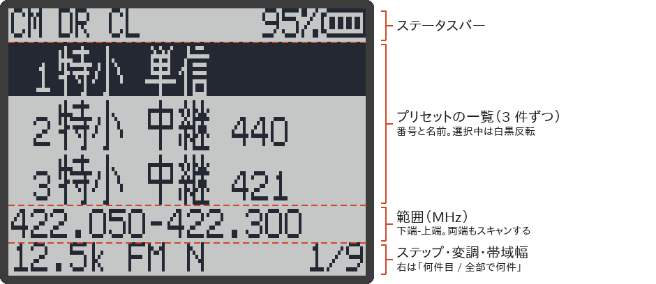
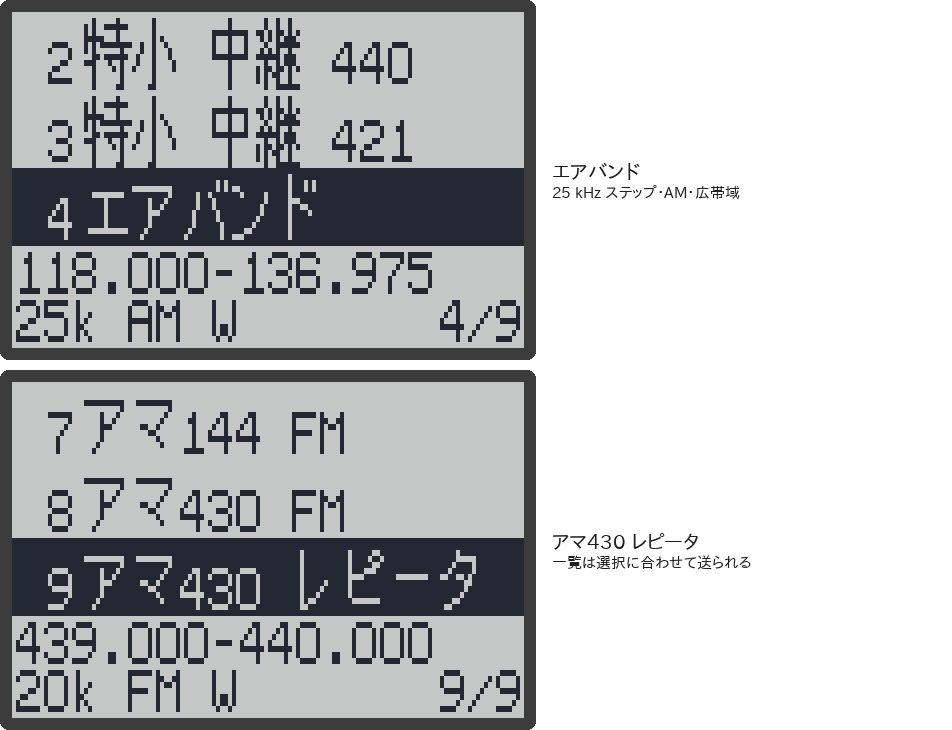
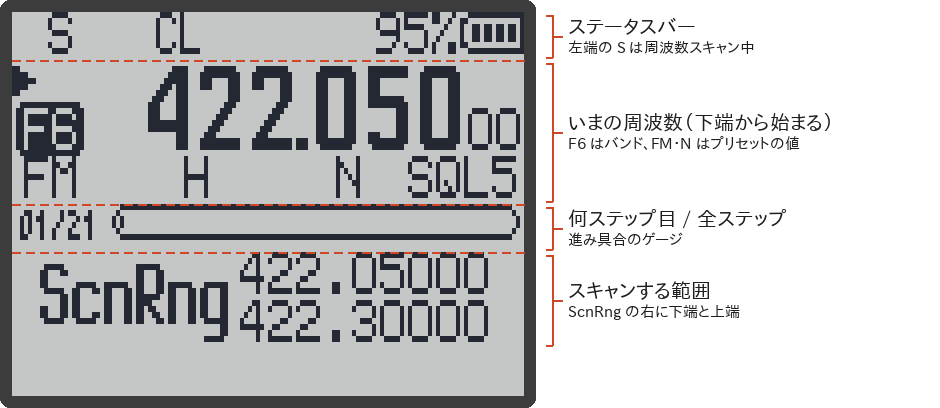

# 受信モード

RxJa で「何を聞くか」を選ぶ方法は、次の 4 つです。

| モード | 何を聞くか | 入り方 | 向いている使い方 |
|---|---|---|---|
| [周波数モード（VFO）](#周波数モードvfo) | 数字キーで入れた周波数 | `F` → `3`（チャンネルモードと切り替え） | 周波数がわかっている、その場で決めて聞く |
| [チャンネルモード（MR）](#チャンネルモードmr) | 登録したチャンネル（最大 1024） | `F` → `3`（周波数モードと切り替え） | いつも聞く周波数を、名前付きで呼び出す |
| [プリセット](#プリセット範囲スキャン) | 決まった周波数帯（特小、エアバンドなど）を範囲スキャン | `F` → `7`（または `7` 長押し） | 周波数を知らない帯域を、一度に探す |
| [FM ラジオ](#fm-ラジオ) | FM 放送（76〜108 MHz） | `F` → `0`（または `0` 長押し） | FM 放送、ワイド FM を聞く |

> [!NOTE]
> このページの内容は、RxJa のソースコードを読んで確かめたもので、主な動作は実機（UV-K1）でも確かめています。画面の図は、ファームの描画プログラムをそのままパソコンで動かして作ったものです。

## どれを使えばよいか

- **周波数がわかっている** → 周波数モードで、その周波数を入れる。
- **何度も聞く周波数がある** → チャンネルに登録して、チャンネルモードで呼び出す（登録は RxJa Tools の [[メモリーチャンネル]] か [[CHIRP]] を使うと楽です）。
- **「特小のどこかで話していないか」のように、帯域はわかるが周波数はわからない** → プリセットを選ぶ。
- **FM 放送を聞く** → FM ラジオ。ほかの 3 つとは別の部品で受信します。

## 周波数モード（VFO）

周波数を直接入れて聞くモードです。画面の段の左に、`F1`〜`F7`（バンドの番号）が白黒反転で出ます（→ [[画面の見かた]]）。

- 上の段（A）と下の段（B）は、それぞれ別の周波数モードを持っています（`F` → `2` で入れ替え）。
- **周波数を入れる**：MHz 単位で 6 けた（1000 MHz 以上は 7 けた）。例：`145000` → 145.000 MHz。
- **少しずつ動かす**：`UP` / `DOWN` で 1 ステップずつ。ステップはメニューの「ステップ（Step）」か、`F` → サイドキーで変えます。
- **バンドを変える**：`F` → `1`（または `1` 長押し）。`F1`〜`F7` のバンドごとに、最後に聞いた周波数と設定が残っています。
- 変調（FM / AM / USB）、帯域幅、ステップなどを変えると、そのまま保存されます。電源を切っても残ります。
- スキャンは、`*` 長押しでバンドの中を全部（周波数スキャン）、`5` 長押しのあと `*` 長押しで A と B の周波数のあいだ（範囲スキャン）です（→ [[スキャン]]）。

## チャンネルモード（MR）

登録しておいたチャンネルを、番号で呼び出して聞くモードです。画面の段の左に、`0001` のようなチャンネル番号が白黒反転で出ます。

- チャンネルは 1024 個まで。1 つずつ、周波数・変調・帯域幅・トーン・名前（全角 5 文字・半角 10 文字まで、日本語も可）などを登録します。
- **呼び出す**：数字キーでチャンネル番号（4 けた）を入れるか、`UP` / `DOWN` で次のチャンネルへ。
- **登録する**：本体のメニューの「CH保存（ChSave）」（→ [[メニュー一覧#チャンネルの保存削除]]）か、パソコンの RxJa Tools（[[メモリーチャンネル]]）や [[CHIRP]] で。たくさん登録するならパソコンが楽です。
- チャンネルを**スキャンリスト**に入れておくと、チャンネルスキャンでまとめて見て回れます（→ [[スキャン#チャンネルスキャン]]）。

> [!TIP]
> チャンネルは「自分で 1 つずつ登録して、呼び出す」もの、プリセットは「帯域ごと用意されていて、選ぶとその帯域を探す」ものです。プリセットで見つけた周波数を何度も聞くなら、チャンネルに登録しておくと便利です。

## プリセット（範囲スキャン）

よく聞かれる周波数帯を、名前付きの一覧から選ぶだけで**範囲スキャン**できる機能です。RxJa v0.1.2 で加えました（元の F4HWN にはありません）。

範囲の両端・ステップ・変調・帯域幅がプリセットに入っているので、自分で周波数やステップを合わせる必要はありません。

### 使い方

1. メイン画面で `F` → `7`（または `7` 長押し）。プリセットの一覧が開きます。
2. `UP` / `DOWN` で選ぶ。数字キーの `1`〜`9` で 1〜9 番、`0` で 10 番に、すぐ移れます。
3. `M` を押すと、範囲スキャンが始まります（メイン画面に戻ります）。
4. やめるときは `EXIT`（何もせずにメイン画面へ戻る）。

スキャン中に開くこともできます。そのときは `M` を押した時点で、いまのスキャンを止めてからプリセットのスキャンに切り替わります。

| キー | 動き |
|---|---|
| `UP` / `DOWN` | 1 つ前 / 次のプリセット（端まで行くと反対の端へ） |
| `1`〜`9`、`0` | 1〜9 番、10 番のプリセットを選ぶ（無い番号は「ピピッ」） |
| `M` | 選んでいるプリセットで範囲スキャンを始める |
| `EXIT` | メイン画面に戻る |
| `PTT` | メイン画面に戻る（送信はしません） |
| そのほか | 「ピピッ」と鳴るだけ |

- 一覧は 3 件ずつ出ます。下の 2 行は、選んでいるプリセットの**範囲**（MHz）と、**ステップ・変調・帯域幅**（`N` = 狭帯域、`W` = 広帯域）です。
- 一覧で選んでいた位置は、次に開いたときも残っています（電源を切るまで）。
- FM ラジオをつけているときは開けません（「ピピッ」）。

### 入っているプリセット

| 番号 | 名前 | 範囲（MHz） | ステップ | 変調・帯域幅 | ステップ数 |
|---|---|---|---|---|---|
| 1 | 特小 単信 | 422.0500〜422.3000 | 12.5 kHz | FM・狭帯域 | 21 |
| 2 | 特小 中継 440 | 440.0250〜440.3625 | 12.5 kHz | FM・狭帯域 | 28 |
| 3 | 特小 中継 421 | 421.5750〜421.9125 | 12.5 kHz | FM・狭帯域 | 28 |
| 4 | エアバンド | 118.000〜136.975 | 25 kHz | AM・広帯域 | 760 |
| 5 | 国際VHF 船舶 | 156.025〜157.425 | 25 kHz | FM・広帯域 | 57 |
| 6 | 国際VHF 海岸 | 160.625〜161.950 | 25 kHz | FM・広帯域 | 54 |
| 7 | アマ144 FM | 144.700〜145.640 | 20 kHz | FM・広帯域 | 48 |
| 8 | アマ430 FM | 432.100〜434.000 | 20 kHz | FM・広帯域 | 96 |
| 9 | アマ430 レピータ | 439.000〜440.000 | 20 kHz | FM・広帯域 | 51 |

- **特小**（特定小電力無線、トランシーバーやインカム）：
  - 1 番の「単信」は、機械どうしで直接話すチャンネルです（L01〜L09、01〜20）。範囲の中の 422.1875 MHz は制御用のチャンネルで、声は出ません。
  - 中継器を使う通話は、親機と子機が 18.45 MHz 離れた 2 つの周波数を使うので、2 番（440 MHz 側）と 3 番（421 MHz 側）に分けています。
- **エアバンド**：航空機と管制の交信。118 MHz より下（108〜117.975 MHz）は航法用の電波で、声は出ないので入れていません。範囲が広いので、1 周に時間がかかります。
- **国際VHF**：船舶の無線。「船舶」は船が送信する側、「海岸」は海岸局が送信する側です。AIS（161.975 / 162.025 MHz、デジタル）は入れていません。
- **アマチュア無線**：JARL のバンドプランの FM の区分です。20 kHz 間隔は日本の慣習で、決まりではありません。同じ区分で使われる D-STAR や C4FM（デジタル）は、この無線機では聞けません。

デジタル化されている無線（消防、警察、デジタル簡易無線、多くの鉄道無線など）は、この無線機では聞けないので入れていません。

プリセットの周波数は、テレコムの「チャンネル互換表」（第 5 版）と ARIB RCR STD-20、総務省の航空無線の資料、国際 VHF のチャンネル表、JARL のバンドプラン（2025-07-17）で確かめました（2026-09-28）。

### 選ぶと何が起きるか

`M` を押すと、次の順に動きます。

1. スキャン中なら、いまのスキャンを止める。
2. メインの段（`▶` の付いたほう）を**周波数モード**にして、範囲の**下の端**の周波数に合わせる（チャンネルモードだったときも、周波数モードに切り替わります）。
3. ステップ・変調・帯域幅を、プリセットの値にする。
4. その範囲で範囲スキャンを始める。

スキャン中の画面は、ふつうの[[範囲スキャン|スキャン#範囲スキャン]]と同じです。下の段に `ScnRng` とスキャンする範囲が出て、まん中の行に「何ステップ目 / 全部で何ステップか」とゲージが出ます。

スキャン中のキー（`M` で止めて見つけた所に残る、`EXIT` で止めて始めた所に戻る、`M` 長押しで除外など）も、範囲スキャンと同じです（→ [[スキャン#スキャン中のキー]]）。「SC速度（SetScn）」を `高速` にすると、プリセットのスキャンも速くなります。

止めたあとも、範囲スキャンのモード（下の段の `ScnRng`）のままです。

- `*` 長押しで、同じプリセットの範囲をもう一度スキャンします。
- 範囲スキャンのモードから抜けるには、`5` 長押し、`EXIT` 長押し、または `F` → `2`（A / B 入れ替え）。

> [!WARNING]
> プリセットを選ぶと、メインの段の周波数モードの**そのバンドの周波数と設定**（ステップ・変調・帯域幅）が、プリセットの値で書き換わって保存されます。たとえば F6 バンドで聞いていた周波数は、特小のプリセットを選ぶと 422.050 MHz に変わります。チャンネル（登録したメモリー）は書き換わりません。

### ふつうの範囲スキャンとのちがい

| | ふつうの範囲スキャン | プリセット |
|---|---|---|
| 範囲の決め方 | A と B に両端の周波数を入れて、`5` 長押し | 一覧から選ぶ |
| ステップ・変調・帯域幅 | メインの段の設定のまま | プリセットの値に変わる |
| B の段 | 範囲の端として使う | そのまま（書き換わらない） |
| スキャン中に電源を切ると | 次に電源を入れたとき、同じ範囲で再開する | **再開しない**（ふつうに起動する） |

電源を入れ直したときに再開しないのは、再開の処理が「A と B の周波数から範囲を作り直す」作りになっていて、プリセットの範囲は覚えていないためです。

### プリセットを変える・増やす

プリセットは、ファームの中ではなく、**日本語データ（`ja_res.bin`）の中**に入っています。そのため、ファームを書き直さなくても、日本語データを送り直すだけで変えられます。

1. `tools/ja/presets_ja.tsv` を編集する（1 行に 1 つ。名前・下端・上端・ステップ・変調・帯域幅をタブで区切る）。
2. `gen_ja_font.py` で `ja_res.bin` を作り直す。書き間違い（無線機に無いステップ、受信できない周波数、長すぎる名前など）があると、ここでエラーになります。
3. `upload.py` か RxJa Tools で、本体に送る。

くわしくは [[訳語の変更とビルド#プリセットを変える]] を見てください。

- 古い日本語データ（v0.1.1 まで）を入れたままだと、一覧は `プリセットなし` になります。日本語データが入っていないときは `NO PRESET` です。
- 新しい日本語データを v0.1.1 までのファームで使っても問題ありません（プリセットの部分は読み飛ばされます）。

## FM ラジオ

FM 放送を聞くモードです。ほかの 3 つのモードとは別の、FM 放送専用の部品（BK1080）で受信します。

- `F` → `0`（または `0` 長押し）でつける / 消す。`EXIT` でも消えます。
- 範囲は `F` → `1` で切り替え。日本では `76-108M` がおすすめです（ワイド FM も入ります）。
- 周波数を直接選ぶ `VFO` と、登録した局（48 局まで）を選ぶ `MR` があり、`F` → `3` で切り替えます。ふつうの受信の周波数モード / チャンネルモードとは別のもので、登録した局もチャンネルとは別に保存されます。
- 局を探す手動スキャンと、見つけた局を全部登録する自動スキャンがあります。

くわしくは [[FMラジオ]] を見てください。

## 電源を切ったとき

| モード | 次に電源を入れたとき |
|---|---|
| 周波数モード、チャンネルモード | 最後の周波数・チャンネルで起動する。スキャン中に切ったときは、同じスキャンを再開する |
| プリセットのスキャン中 | スキャンは再開しない。メインの段は周波数モードのまま起動する |
| FM ラジオ | FM ラジオをつけたまま切ったときは、FM ラジオがついた状態で起動する |

## 関連ページ

- [[キー操作]]
- [[スキャン]]
- [[FMラジオ]]
- [[CHIRP]]
- [[画面の見かた]]
