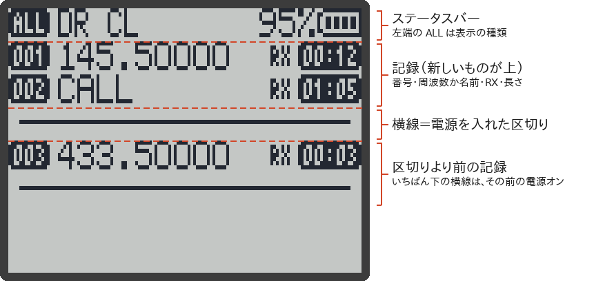
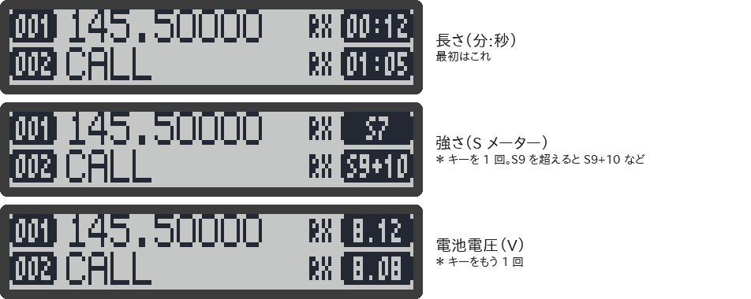

# 受信ログ

受信ログは、**いつ・どの周波数（チャンネル）を・どのくらいの長さ・どのくらいの強さで受信したか**を、無線機の中に記録する機能です。スキャンを放っておいて、あとで「どこで何が聞こえたか」を確かめるのに便利です。

> [!NOTE]
> このページの内容は、RxJa のソースコードと、元の F4HWN Wiki を読んで確かめたもので、主な動作は実機（UV-K1）でも確かめています。

## 使えるようにする

受信ログには、メニューの「オン / オフ」の項目がありません。代わりに、**サイドキーか M 長押しに「受信ログ（RF LOG）」を割り当てると、記録が始まります**。

1. メニューの「F1短押（F1Shrt）」「F1長押（F1Long）」「F2短押（F2Shrt）」「F2長押（F2Long）」「M長押（M Long）」のどれかを開く（→ [[メニュー一覧]]）。
2. 「受信ログ」を選んで決定する。

これで、次の受信から記録されます。割り当てたキーを押すと、受信ログの画面が開きます。

> [!IMPORTANT]
> どのキーにも「受信ログ」を割り当てていないと、**何も記録されません**。あとから割り当てても、それより前の受信は残っていません。
>
> 割り当てを外すと記録は止まりますが、それまでの記録は消えません（もう一度割り当てれば、また見られます）。

> [!TIP]
> どのキーに割り当てるか迷ったら、「F2長押（F2Long）」や「M長押（M Long）」がおすすめです。初期化（`ALL`）のあとは、どちらも「なし」になっています（→ [[キー操作]]）。

## 記録されるもの

受信が 1 回終わるごとに、1 件の記録になります。

| 項目 | 内容 |
|---|---|
| 周波数 | 受信した周波数 |
| チャンネル | チャンネルモードで受信したときは、そのチャンネルの番号 |
| 長さ | 受信していた時間（秒。1 秒より短くても 1 秒と記録） |
| 強さ | 受信している間の、いちばん強い S メーターの値 |
| 電池 | 受信している間の、いちばん低い電池電圧 |

- ふつうの受信（スケルチが開いたとき）と、モニター（スケルチを開けて聞いているとき）の両方が記録されます。どちらも `RX` と表示されます。
- **スキャンで止まった信号も記録されます**（止まるたびに 1 件）。
- 電源を入れるたびに、区切りの線が 1 本入ります（電源を入れてから何も受信しないまま、また電源を入れ直したときは、線は増えません）。
- RxJa は送信しないので、送信（`TX`）の記録はありません。
- FM ラジオを聞いている間は記録されません（ソースコードから読み取ったこと。実機では未確認）。

### 記録できる数

- 無線機の中には、1024 件まで記録できます。いっぱいになると、**古いものから順に消えて**、新しいものに入れ替わります。
- 受信ログの画面で見られるのは、**新しいほうから 512 件**までです。
- 電源を切っても、記録は消えません。
- <strong>初期化（Reset）をしても、記録は消えません。</strong>消すときは、下の「記録を消す」の操作をしてください。

## 画面の見かた

（画面は、ファームの描画プログラムをそのままパソコンで動かして作ったものです）

1 画面に 7 行ずつ、**新しいものが上**に並びます。

| 表示 | 意味 |
|---|---|
| `001` など（左の白黒反転） | 新しいほうから数えた番号（001〜512） |
| 周波数 / チャンネル名 | チャンネルで受信した記録は、そのチャンネルの名前。名前が無いとき、名前が日本語のとき（行が低くて入らないため）、または周波数で受信したときは、周波数 |
| `RX` | 受信の記録 |
| 右の白黒反転 | 長さ（`分:秒`）、強さ（`S0`〜`S9`、`S9+10` など）、電池電圧（`7.85` など）のどれか。`*` で切り替え |
| 横線 | 電源を入れた区切り（表示の種類が `ALL` のときだけ） |
| ステータスバーの左端 | 表示の種類（`ALL` / `RX` / `TX`） |
| `記録なし` | 記録が 1 件も無い |

右の白黒反転は、`*` を押すたびに次のように変わります。

> [!NOTE]
> チャンネル名は、**画面を開いたときの**チャンネルの名前です。記録したあとでチャンネルの名前を変えたり、チャンネルを消したりすると、表示も変わります。

## キー操作

| キー | 動き |
|---|---|
| `UP` / `DOWN` | 新しい記録 / 古い記録のほうへ 1 行ずつ動かす（端で止まる） |
| `F` → `UP` | いちばん新しい記録へ |
| `F` → `DOWN` | いちばん古い記録（見られる範囲の最後）へ |
| `*` | 右の欄を、長さ → 強さ → 電池電圧 → 長さ… と切り替える |
| `M` | 表示の種類を `ALL`（すべて）→ `RX`（受信だけ）→ `TX`（送信だけ）と切り替える |
| `M` 長押し | 記録を消す（下記） |
| `EXIT` | メイン画面に戻る |
| `F` 長押し | キーロック |
| 数字 | エラー音が鳴るだけ |

RxJa には送信の記録が無いので、`RX` は「`ALL` から区切りの線を抜いたもの」、`TX` はいつも `記録なし` になります。

## 記録を消す

1. 受信ログの画面で `M` を長押しする。画面に `ログ消去` / `実行する?` と出ます。
2. **もう一度 `M` を長押しする**と、すべての記録が消えます。消している間は `記録なし` と出て、キーは効きません。

やめるときは、`EXIT`、`UP` / `DOWN`、`F`、`*`、`M`（短押し）、`PTT` のどれかを押してください。

> [!WARNING]
> 消した記録は元に戻せません。残しておきたいときは、先に RxJa Tools の「RF ログ書き出し」（本家 UV Studio でも可）で CSV に保存してください（→ [[UV-Studio#rf-log--export-rf-log受信ログ]]）。

## パソコンで見る

ブラウザのツール「UV Studio」を使うと、パソコンで受信ログを見られます。

- **RF Log**：つないでいる間に受信したものが、一覧に流れます。
- **Export RF Log**：無線機に残っている記録（新しいほうから 512 件）を読み出して、CSV ファイルに保存します。

くわしくは [[UV-Studio]] を見てください。

## 関連ページ

- [[キー操作]]
- [[スキャン]]
- [[UV-Studio]]
- [F4HWN Wiki の Advanced features / RF log（英語）](https://github.com/armel/uv-k1-k5v3-firmware-custom/wiki/Advanced-features#rf-log)
