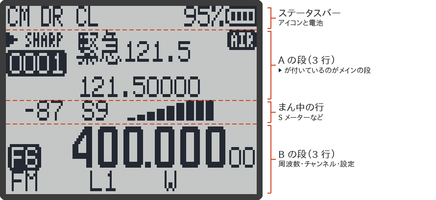
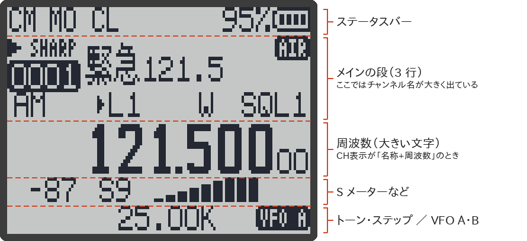
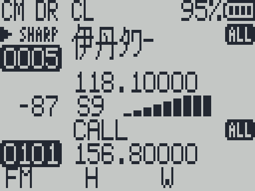
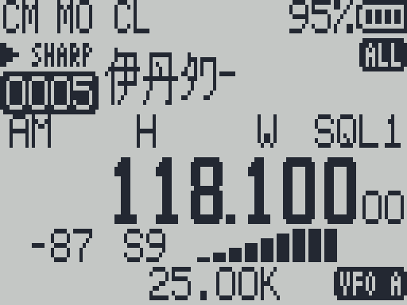
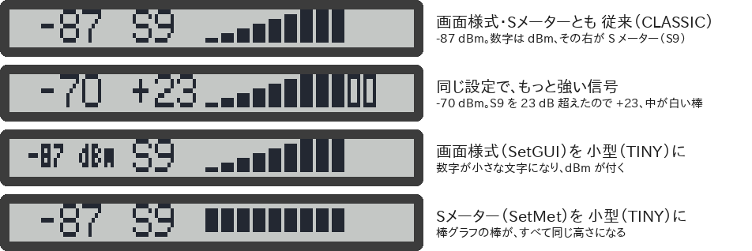

# 画面の見かた

RxJa の画面は、128×64 ドットの白黒液晶です。いちばん上の細い 1 行が**ステータスバー**、その下が**メイン画面**です。

このページでは、メイン画面（電源を入れたあとのふつうの画面）で、どこに何が出るかを説明します。メニューの画面は [[メニュー一覧]]、スペクトラム・FM ラジオ・受信ログの画面は、それぞれのページを見てください。

> [!NOTE]
> - このページの内容は、RxJa のソースコードを読んで確かめたもので、主な動作は実機（UV-K1）でも確かめています。
> - このページの画面の画像は、実機の写真ではありません。RxJa の画面を描くプログラム（`App/ui/main.c`・`App/ui/status.c`）をそのままパソコンで動かして作ったものです。文字や記号の位置は実機と同じはずですが、液晶の色あいや見え方は実機とちがいます。
> - 日本語になっているのは、メニューと、メッセージ（「送信禁止」「ようこそ」「F長押しで解除」など）です。**メイン画面の小さな略語（`SQL5`、`CT`、`W` など）は英語のまま**です。表示できる幅が数文字しかないためです。このページで意味を説明します。
> - パソコンで画面を見たいときは、[[UV-Studio]] の Live Viewer を使うと、実機の画面をそのまま映せます。

## 画面の区切り

画面は、上から 8 ドットずつの「行」に分かれています。「受信方式（RxMode）」の設定によって、並び方が 2 とおりあります（→ [[メニュー一覧#受信方式rxmode]]）。

### A と B の 2 段を表示するとき

受信方式が `メインのみ` **以外**（`2波受信 追従`、`サブのみ`、`2波受信 メイン固定`、`全波受信 追従`、`全波受信 メイン固定`）のときです。

A（チャンネル 0001、名前は `緊急121.5`、121.5 MHz の AM）で受信しているところです。B は周波数モード（VFO）で 400.000 MHz です。

CH表示は `名称+周波数`（v1.1.0 からの既定）です。A は日本語の名前なので、名前の下に周波数が小さく出て、3 行目の略語は省かれています（→ [CH表示ごとの見え方](#ch表示chdispごとの見え方)）。

### 1 段だけを表示するとき

受信方式が `メインのみ` のときは、メインの段だけが大きく出ます。

上と同じチャンネル 0001（`緊急121.5`、121.5 MHz の AM）を、CH表示 `名称+周波数` で受信しているところです。1 段表示では、日本語の名前でも 3 行目の略語は省かれず、周波数は大きい文字で出ます。右下の `VFO A` は、いまの段が A か B かを示します。

## ステータスバー

画面のいちばん上の行です。左から順に、次のものが出ます。

| 位置 | 表示 | 意味 |
|---|---|---|
| 左端 | `00:12` のような時間 | 「タイマー（SetTmr）」が ON のとき、いまの受信が何分何秒続いているか |
| 左端 | `CM` / `C1`〜`C4` | タイマーが OFF のときに、いま使っている設定の組が出る（`CM` は `CFG M`、`C1` は `CFG 1` の意味。→ [[マルチブート#設定の組を切り替える設定切替]]）。v1.2.0 より前は、ここに省電力のマークが出ていました |
| 左寄り | 白黒反転した 3 文字（リスト名）、`01`〜`24`、`ALL` | **メモリースキャン中**。いまスキャンしているスキャンリスト。名前を付けたリストは名前の先頭 3 文字、名前が無ければ番号。後ろに `+` が付くのは、優先チャンネル（SC優先）が有効のとき |
| 左寄り | `S` | **周波数スキャン中**（VFO のスキャンや、範囲スキャン） |
| 中ほど | `DR` | 2 波受信（A と B を交互に見張る）が動いている。受信方式が `サブのみ` のときは `DW`（v1.2.0 より前は 3 文字の `DWR` でした） |
| 中ほど | `FR` | 全波受信（A・B と優先チャンネルを順に見張る）が動いている。`サブのみ` と組み合わせたときは `FW`（v1.2.0 から。→ [[メニュー一覧#受信方式rxmode]]） |
| 中ほど | 一時停止のマーク | 2 波受信・全波受信の設定だが、いまは止まっている（受信中やメニューを開いているときなど） |
| 中ほど | `XB` | 受信方式が `サブのみ` |
| 中ほど | `MO` | 受信方式が `メインのみ` |
| 中ほど | PTT のマーク | 送信関係の設定「SetPTT」の値を表すマークです。RxJa では送信しないので**意味はありません**（→ [[受信専用のしくみ]]） |
| 右寄り | 鍵のマーク | キーロック中（→ [[キー操作]]） |
| 右寄り | `F` | F キーが押された（次のキーが F+キー になる） |
| 右寄り | スピーカーに斜線のマーク | 消音（MUTE）中。サイドキーに「消音」を割り当てて使う |
| 右寄り | 電球のマーク | バックライトを点けっぱなしにしている（F+8）。「照明時間（BLTime）」が OFF のときは、中が白い電球になる |
| 右寄り | USB のマーク | USB-C で充電中 |
| 右端 | 電池のマーク | 電池の残り。「電池表示（BatTxt）」の設定で、横に `8.12` のような電圧か、`80%` のような残量が出る |

右寄りの 5 つ（鍵・F・消音・電球・USB）は、同じ場所を使うので、**いちどに 1 つだけ**出ます。上の表の順に優先されます（たとえば、キーロック中は `F` も充電中のマークも出ません）。

> [!TIP]
> 受信ログの画面では、ステータスバーの左端に、いま表示している記録の種類（`ALL` / `RX` / `TX`）が出ます（→ [[受信ログ]]）。

## A / B の段

1 つの段は 3 行です。

### 1 行目・2 行目

| 位置 | 表示 | 意味 |
|---|---|---|
| 左端 | `▶` | メインの段。`F+2`（または `2` の長押し）で A と B を入れ替える。このメインの段で受信していると点滅する |
| 左上 | `FLAT`、`CLEAN`、`MID`、`BOOST`、`MAX` | FM で受信中。いまの「受信音質（SetRxA）」の設定 |
| 左上 | `SHARP`、`STOCK`、`OPEN` | AM で受信中。いまの受信音質の設定 |
| 左上 | `USB` | USB（SSB）で受信中 |
| 左上 | `>>` | 2 段表示のとき、**最後に信号が入ったのがこの段**であることを示す（いまは受信していない） |
| 左上 | 鍵のマーク | そのチャンネルの「TXLock」（送信禁止）の設定が入っている。RxJa では送信しないので気にしなくてよい |
| 左、2 行目 | 白黒反転の `0001` など | **チャンネルモード（MR）**。チャンネル番号（1〜1024）。数字キーで番号を入力している間は、入力中の数字 |
| 左、2 行目 | 白黒反転の `F1`〜`F7` | **周波数モード（VFO）**。いまの周波数が入っているバンドの番号。1 GHz 以上では `F7+` のように `+` が付く |
| まん中（大きい文字） | `145.500` など | 周波数（MHz）。いちばん下の 2 けた（10 Hz と 1 Hz の位）は、右端に小さく出る。1 GHz 以上は、ふつうの大きさの文字で 1 行に出る |
| まん中（大きい文字） | `CH-0001` や、チャンネル名 | チャンネルモードで、「CH表示（ChDisp）」の設定がチャンネル番号・名称のとき（下の表） |
| まん中（大きい文字） | `送信禁止` | PTT を押したとき。PTT を離して 2.5 秒たつと消える（→ [[受信専用のしくみ]]） |
| 右上 | 白黒反転の `ALL`、`OFF`、`01`〜`24`、リスト名 3 文字、`EX` | チャンネルモードで、**このチャンネルが入っているスキャンリスト**。`ALL` はすべてのリスト、`OFF` はどのリストにも入っていない、`EX` はスキャンで飛ばす（除外）印が付いている（→ [[スキャン]]） |
| 右端、2 行目 | コンパンダーのマーク | そのチャンネル（周波数）でコンパンダー（Compnd）が有効 |

#### CH表示（ChDisp）ごとの見え方

チャンネルモード（MR）のときだけ、まん中の大きい文字が次のように変わります。周波数モード（VFO）では、いつも周波数です。

| CH表示 | まん中に出るもの |
|---|---|
| 周波数（FREQ） | 周波数 |
| CH番号（CHANNEL NUMBER） | `CH-0001` のようなチャンネル番号 |
| 名称（NAME） | チャンネル名（英数字なら最大 10 文字、日本語なら全角 5 文字・半角 10 文字）。名前が無いチャンネルは `CH-0001` |
| 名称+周波数（NAME + FREQ） | 2 段表示のときは、1 行目にチャンネル名、2 行目に小さく `145.50000` のような周波数（日本語の名前は下を参照）。1 段表示のときは、名前と周波数が両方とも大きく出る |

日本語の名前（v1.1.0 から。付け方は [[メモリーチャンネル#日本語の名前]]）は、英数字より背の高い 12 ドットの文字で出ます。そのため 2 段表示で「名称+周波数」のときは、日本語名のチャンネルの段だけ、**名前の下に周波数を出し、その下の 3 行目（設定の略語）を省きます**。

日本語データが古い（v1.0.0 以前の）ときは、日本語の名前の代わりに `CH-0001` のような番号が出ます。

### 3 行目（設定の略語）

段のいちばん下の行には、その周波数の設定が略語で並びます。並び方と文字の大きさは、「画面様式（SetGUI）」で変わります。

- `小型`（TINY）：いちばん小さい文字で、1 行にたくさん並ぶ。略語は少し長め（`WIDE` など）
- `従来`（CLASSIC）：ふつうの小さい文字。略語はいちばん短い（`W` など）

| 小型（TINY） | 従来（CLASSIC） | 意味 |
|---|---|---|
| `FM` / `AM` / `USB` | `FM` / `AM` / `USB` | 変調（Mode） |
| `LOW1`〜`LOW5`、`MID`、`HIGH` | `L1`〜`L5`、`M`、`H` | 送信出力の設定値。**RxJa では意味はありません**。横に小さな矢印が付くのは「USER」出力のとき |
| `+` / `-` | `+` / `-` | 送信周波数のずれ（オフセット）の向き。**RxJa では意味はありません**。CHIRP などでオフセットが入っているチャンネルだけに出る |
| `R` | `R` | リバース（送信と受信の周波数を入れ替える）が ON。`8` の長押しで切り替わる。オフセットが入っていると、受信周波数も入れ替わるので注意 |
| `CT` | `CT` | CTCSS（トーンスケルチ）が設定されている |
| `DC` | `DC` | DCS（デジタルコードスケルチ）が設定されている |
| `88.5` など | （1 段表示のときだけ、最下行に出る） | CTCSS の周波数（Hz） |
| `023N`、`023I` など | （同上） | DCS のコード。`N` は正極性、`I` は逆極性 |
| `12.50K` など | （1 段表示のときだけ、最下行に出る） | トーンが無いときは、周波数ステップ（kHz） |
| `WIDE` / `NAR` / `NAR+` | `W` / `N` / `N+` | 帯域幅。広帯域 / 狭帯域 / 超狭帯域（「狭帯域（SetNFM）」の設定で、狭帯域をさらに狭くしたとき） |
| `SQL5` など | `SQL5` など | スケルチのレベル（0〜9）。**メインの段だけ**に出る。`F+UP` / `F+DOWN` で変わる |
| `MONI` | `MONI` | モニター中（スケルチを開けて、雑音ごと聞いている）。サイドキーの「モニター」で切り替える |

## まん中の行（2 段表示のとき）

A の段と B の段のあいだの 1 行（1 段表示のときは、下から 2 行目）には、そのときの状態に合わせて、次のどれかが出ます。

### 受信中：S メーター

| 表示 | 意味 |
|---|---|
| `-87` | 受信している信号の強さ（dBm）。-53 dBm より強い信号は `-53` で止まる。画面様式が `小型`（TINY）のときだけ、後ろに `dBm` が付く |
| `S0`〜`S9` | S メーター。-93 dBm 以上が S9 |
| `+10`〜`+40` | S9 より強いとき、S9 を何 dB 超えているか（`S9` の代わりに出る） |
| 棒グラフ | S0〜S9 は塗りつぶしの棒、S9 を超えた分は中が白い棒（最大 4 本） |

- 棒グラフの形は「Sﾒｰﾀｰ（SetMet）」で変わります。`従来`（CLASSIC）は、右へ行くほど背が高くなる棒、`小型`（TINY）は、すべて同じ高さの棒です。
- dBm の数字の文字の大きさは、「画面様式（SetGUI）」で変わります。`小型`（TINY）では、いちばん小さい文字になり、`dBm` が付きます。
- 受信中は、メインの段の `▶` が点滅します。

### スキャン中（信号が無いとき）：進み具合

スキャン中で、信号が入っていないときは、進み具合のゲージが出ます（→ [[スキャン]]）。

| 表示 | 意味 |
|---|---|
| `12/40` のような数字 | メモリースキャン：スキャンリストの中の何番目のチャンネルか / リストのチャンネル数。範囲スキャン：範囲の中の何番目のステップか / 全体のステップ数 |
| `P1` / `P2` | 優先チャンネル（SC優先）を使っているとき。優先チャンネル 1 / 2 を見に行っていることを示す |
| ゲージ | 全体のどこまで進んだか |
| `SCAN LIST 03` など | メモリースキャン中にスキャンリストを切り替えたとき、約 1 秒だけ、切り替えた先のリスト（名前があれば名前）が出る。そのあいだはスキャンも待つ |

「SC速度（SetScn）」が `高速`（FAST）のときは、スキャンしている段の上の行に、最近見た信号の強さが小さな波形で出ます。

### そのほか

| 表示 | 意味 |
|---|---|
| `DTMF 123` のような文字 | 「DTMF（D Live）」が ON のとき、受信した DTMF の数字 |
| `F長押しで解除` | キーロック中にキーを押したとき（約 2 秒）。`F` の長押しでロックが外れる |
| `TRIPLE WATCH` / `QUAD WATCH` と `>>>>`、チャンネル番号 | 全波受信（`全波受信 追従` / `全波受信 メイン固定`）で待ち受けているとき。見張っている優先チャンネルが 1 つなら `TRIPLE WATCH`、2 つなら `QUAD WATCH` で、その番号が白黒反転で並びます。`>>>>` は見回っているあいだ流れます。受信中・スキャン中・メニューを開いているあいだは出ません（v1.2.0 から） |

## そのほかの表示

| 表示 | 意味 |
|---|---|
| `電池残量低下` / `EXITで戻る` | 電池が少なくなった。`EXIT` で消える。早めに充電してください |
| `キーを離してください` | 電源を入れたときにキーが押されたままになっている。キーを離すと起動が進む |
| 段の代わりに `>123` | `*` を短く押して、DTMF の入力モードになっている。送信はしないので使い道はありません。SIDE1 を短く押すと 1 文字ずつ消え、空になると抜けます。`EXIT` の長押しでも抜けます |
| B の段の代わりに `ScnRng` と 2 つの周波数 | 範囲スキャンのモード（周波数モードで `5` の長押し、またはプリセットを選んだあと）。2 つの周波数は、スキャンする範囲の下の端と上の端（→ [[スキャン#範囲スキャン]]）。1 段だけを表示しているときは、メインの段の下のほうに出ます |

## 起動画面

電源を入れると、約 2.5 秒間、起動画面が出ます。どれかキーを押すと、すぐにメイン画面へ進みます。何を出すかは「起動表示（POnMsg）」で選びます。

| 起動表示 | 画面 | 音 |
|---|---|---|
| すべて（ALL） | メッセージ（下の表）と電池の電圧・残量 | ピピピッ |
| 音のみ（SOUND） | 何も出さない | ピピピッ |
| メッセージ（MESSAGE） | メッセージ | なし |
| 電圧（VOLTAGE） | `電圧` と、`8.12V 95%` のような電池の電圧・残量 | なし |
| ロゴ（LOGO） | RxJa Tools・UV Studio で書き込んだ絵（→ [[UV-Studio]]） | ピピピッ |
| なし（NONE） | 何も出さない | なし |

メッセージは、CHIRP の「Message Line 1 / 2」で書き込んだ 2 行です（半角英数字、各 16 文字まで。→ [[CHIRP]]）。

| 書き込んだメッセージ | すべて（ALL） | メッセージ（MESSAGE） |
|---|---|---|
| 2 行とも入っている | 1 行目、2 行目 | 1 行目、2 行目 |
| 1 行目だけ入っている | 1 行目と、電池の電圧・残量 | 1 行目と、`BIENVENUE`（フランス語の「ようこそ」。英字のまま） |
| 2 行目だけ入っている | 2 行目と、電池の電圧・残量 | `ようこそ` と、2 行目 |
| 2 行とも空 | `ようこそ` と、電池の電圧・残量 | `ようこそ` |

メッセージや電圧の下には、どの表示でも（ロゴと、何も出さないとき以外）、次の 2 つが出ます。

- 白黒反転の帯の中に `UVK1-RxJa v1.2.0`（RxJa の名前と版）
- その下に `F4HWN v6.1.0 ﾍﾞｰｽ`（もとにした F4HWN の版）

## スクリーンセーバー

「省電画面（SetSav）」を OFF 以外にすると、バックライトが消えたときに、画面にスクリーンセーバーが出ます。

| 省電画面 | 表示 |
|---|---|
| OFF | 出さない（バックライトが消えるだけ） |
| ロゴ（LOGO） | RxJa Tools・UV Studio で書き込んだ絵 |
| ロゴ+（LOGO+） | 同じ絵が、横に流れる |
| マトリクス（MATRIX） | 文字が上から降ってくるアニメーション |

- 出るのは、メイン画面と FM ラジオの画面だけです。
- 「照明時間（BLTime）」が OFF（バックライトを点けない）と ON（常時点灯）のときは出ません。
- **受信が始まると、スクリーンセーバーは消えて、メイン画面に戻ります**。受信中は出ません。
- どれかキーを押すと、スクリーンセーバーが消えてバックライトが点きます。**このとき押したキーは、操作としては働きません**（うっかり設定を変えないため）。PTT だけは例外で、そのまま PTT として扱われます。

## 画面が消えたとき（スリープ）

「自動OFF（SetOff）」を設定すると、キーを押さない時間が続いたときに、画面とバックライトが消えます。これは**電源が切れたのではなく、スリープ**です。受信は続いています。

- 信号を受信するか、どれかキーを押すと、画面が戻ります。起こすときに押したキーは、操作としては働きません（PTT は例外）。
- スリープに入る前の 10 秒間は、バックライトが点滅して知らせます。
- スリープ中は、赤い LED がときどき点滅します。
- 「省電力（BatSav）」を ON にしているときは、スリープ中に信号を確かめる間隔が、ふだんの 20 倍に長くなります（電池を長もちさせるため）。短い信号は聞き逃すことがあります。
- 詳しくは [[メニュー一覧]] の「自動OFF（SetOff）」を見てください。

> [!TIP]
> バックライトだけが消えているときに `EXIT` を押すと、バックライトが点くだけで、EXIT の操作はしません。暗いところで画面を確かめたいときに便利です。

## 関連ページ

- [[キー操作]]
- [[メニュー一覧]]
- [[スキャン]]
- [[受信専用のしくみ]]
