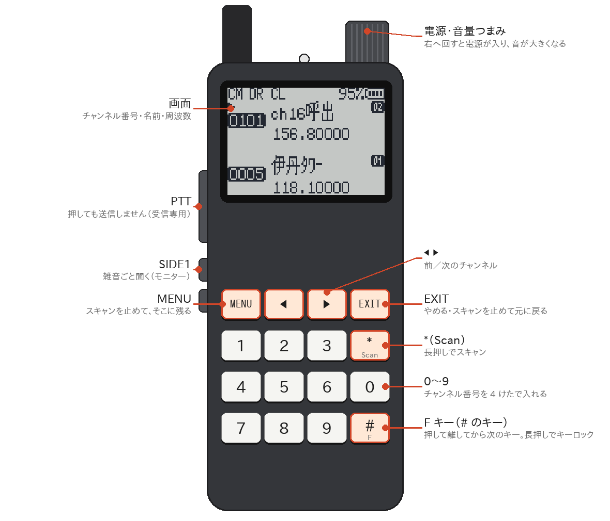
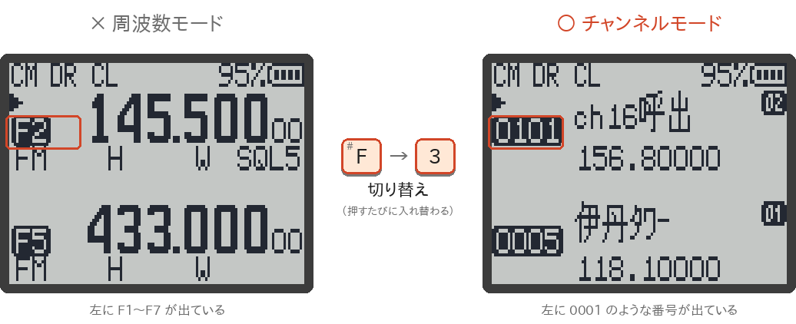
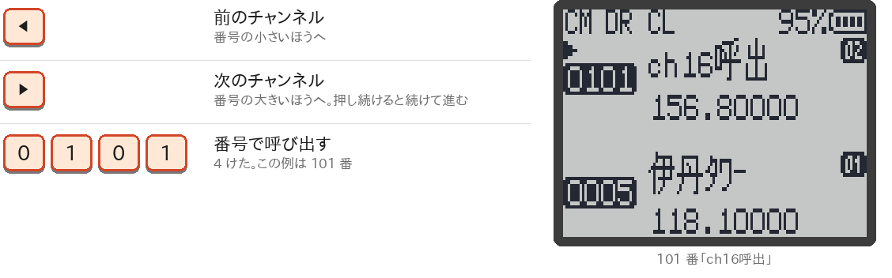
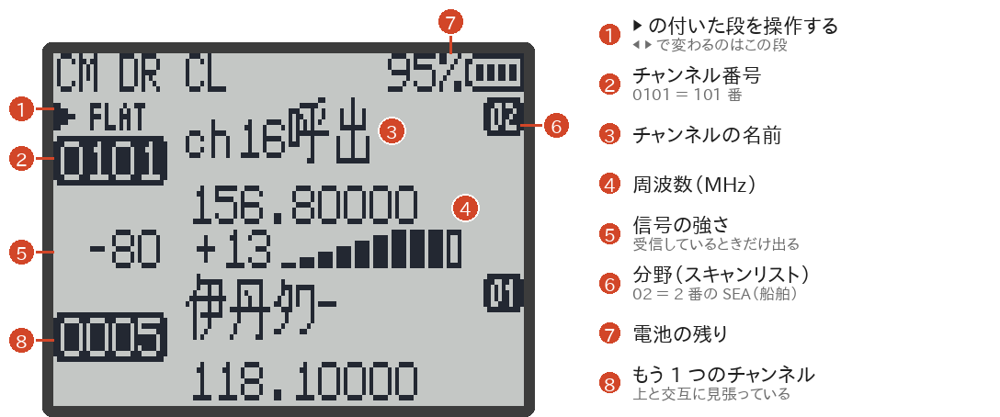
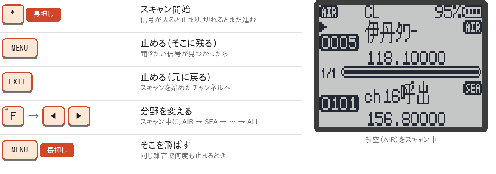
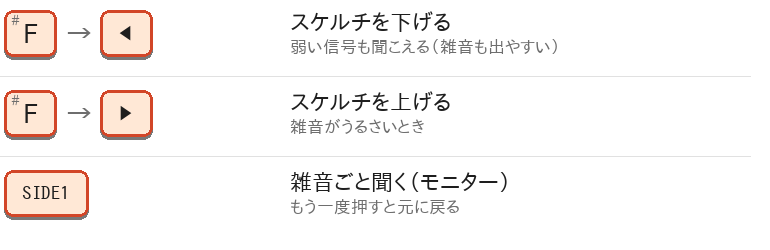
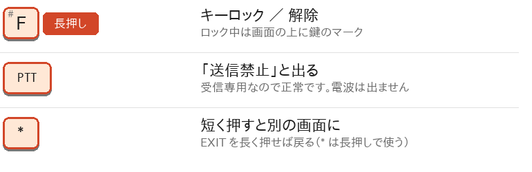

# 簡単操作チートシート

登録しておいたチャンネルを**呼び出して聞くだけ**の、いちばんシンプルな使い方です。メニューの設定はさわらなくても使えます。

> [!TIP]
> **チャンネルは先にパソコンで入れておきます。** [[RxJa Tools のメモリーチャンネル|メモリーチャンネル]]の画面で「**日本(関西中心)のよくある周波数**」を押して本体へ書き込めば、航空・船舶・特小など 299 チャンネルがまとめて入ります。このページの例も、このチャンネルです。

細かい操作は [[キー操作]]、画面のくわしい見かたは [[画面の見かた]] にあります。

## 本体のキー

色の付いたキーだけ覚えれば使えます。

- **F キー**は、`#` と書いてあるキーです。
- <strong>「F → 3」</strong>は、F を押して<strong>離して</strong>から 3 を押す、という意味です（同時に押すのではありません）。F を押すと、画面の右上に `F` が出ます。
- **長押し**は、約 1 秒押したままにします。

## ① 電源を入れる

上の**つまみを右へ回す**と電源が入ります。もっと回すと音が大きくなります。左へ回し切ると電源が切れます。

## ② チャンネルモードにする

画面の左に `0001` のような**チャンネル番号**が出ていれば、そのままで大丈夫です。`F1`〜`F7` が出ているときは、**F → 3** でチャンネルモードに切り替えます。一度切り替えれば、電源を切っても次からはチャンネルモードで始まります。

## ③ チャンネルを選ぶ

「よくある周波数」を入れたときは、分野ごとに番号が分かれています。

| 番号 | 分野 | 例 |
|---|---|---|
| `0001`〜 | 航空 | `0001` 緊急121.5、`0005` 伊丹ﾀﾜｰ、`0012` 関空ﾀﾜｰ |
| `0101`〜 | 船舶 | `0101` ch16呼出 |
| `0151`〜 | 鉄道 | `0151` JR西C414.4 |
| `0201`〜 | 宇宙 | `0201` ISS音声 |
| `0251`〜 | 防災相互波 | `0251` 防災150帯 |
| `0301`〜 | 放送（FM） | `0307` FM大阪 |
| `0351`〜 | 市民ラジオ | `0351` 市民ﾗｼﾞｵ1 |
| `0401`〜 | 特定小電力 | `0401` 特小単信01、`0421` 特小中継01 |
| `0501`〜 | アマチュア | `0502` 144M呼出、`0521` 高槻430 |

## ④ 画面を読む

上と下の 2 段に、それぞれチャンネルが出ます。**▶ の付いた段**が、◀ ▶ や数字キーで変わる段です。上と下の入れ替えは **F → 2** です。電波が入ると音が出て、⑤ の信号の強さが出ます。

## ⑤ スキャンで探す

どのチャンネルで話しているかわからないときは、スキャンで自動で探します。電波が入ったチャンネルで止まり、電波がなくなると、少しするとまた回り始めます。

スキャン中は、画面の左上に、いま回している**分野**（スキャンリスト）が出ます。分野は F → ◀ ▶ で順に変えるほか、スキャン中に**数字 2 けた**を押してすぐ選べます。

| 画面の表示 | 分野 | 数字 2 けた |
|---|---|---|
| `AIR` | 航空 | `01` |
| `SEA` | 船舶 | `02` |
| `RAL` | 鉄道 | `03` |
| `SAT` | 宇宙（ISS・衛星） | `04` |
| `PUB` | 防災相互波 | `05` |
| `BC` | 放送（FM） | `06` |
| `CB` | 市民ラジオ | `07` |
| `TKK` | 特定小電力（特小） | `08` |
| `HAM` | アマチュア | `09` |
| `ALL` | ぜんぶ | `00` |

> [!TIP]
> スキャンしたまま電源を切ると、次に電源を入れたときもスキャンから始まります。止めたいときは MENU か EXIT を押します。

## ⑥ 聞こえない・雑音がうるさいとき

まず**音量つまみ**を確かめてください。それでもだめなときは、次の操作をします。

- **スケルチ**は、「これより弱い電波では音を出さない」という門のようなものです。0〜9 の 10 段階で、下げるほど弱い電波まで聞こえます（雑音も出やすくなります）。
- SIDE1 は、初期の割り当てのままならモニターです（割り当ては変えられます → [[キー操作#サイドキーside1--side2--m-長押し]]）。

## ⑦ 知っておくと安心

## 困ったら

| こんなとき | こうする |
|---|---|
| どこにいるのかわからなくなった | `EXIT` を何回か押すと、メニューなどから、いつもの画面に戻ります |
| 画面の右上に `F` が出たまま | F を押した状態です。もう一度 F を押すと消えます |
| キーを押すと「ピピッ」と鳴って `F長押しで解除` と出る | キーロック中です。**F を長押し**して外します |
| しばらくすると画面が消える | 電源は切れていません（スリープ）。キーを押すと戻ります |
| F → 3 を押しても `F1`〜`F7` のまま | チャンネルが 1 つも登録されていません → [[メモリーチャンネル]] |
| 表示が英語のまま | 日本語データが入っていません → [[日本語データの転送]] |

ほかは [[トラブルシューティング]] を見てください。

## 最初に一度だけ（必要なら）

ふだんの操作ではありませんが、画面を見やすくする設定です。どちらもメニュー（`MENU`）で変えます（→ [[メニュー一覧]]）。

| したいこと | メニュー | 選ぶもの |
|---|---|---|
| チャンネルの名前を出す | 「表示」→「CH表示」 | `名称+周波数`（RxJa v1.1.0 を初めて入れたときは、はじめからこれ） |
| 画面を 1 段で大きくする | 「無線」→「受信方式」 | `メインのみ`（上下 2 つのチャンネルを交互に見張るときは `2波受信 追従`） |

> [!IMPORTANT]
> 受信すること自体は自由ですが、電波法第 59 条により、特定の相手に向けた通信の内容を他人に漏らしたり、利用したりしてはいけません。

## もっと使いこなすには

- [[受信モード]] — 周波数を直接入れて聞く、**F → 7** のプリセットで特小やエアバンドを探す
- [[FMラジオ]] — **F → 0** で FM 放送を聞く
- [[スキャン]] — スキャンの細かい動き、分野（スキャンリスト）の作り方
- [[キー操作]]、[[画面の見かた]] — すべてのキーと表示の説明

> [!NOTE]
> 画面の図は、RxJa の画面を描くプログラムをそのままパソコンで動かして作ったものです。本体の絵は、取扱説明書の図をもとにした模式図です。色の付いたキーが、押すキーです。
