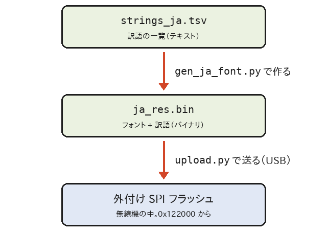

# 訳語の変更とビルド

このページは、**画面に出る日本語（訳語）やプリセットを自分で変えたい人**と、**ファームを自分でビルドしたい人**向けです。ふつうに使うだけなら、読まなくてかまいません。

訳語と[[プリセット|受信モード#プリセット範囲スキャン]]は、ファームとは別のデータ（`ja_res.bin`）に入っています。訳語やプリセットを変えるだけなら、**ファームを書き直す必要はありません**。データを作り直して、無線機に送り直すだけです。



## 用意するもの

| もの | 用途 |
|---|---|
| RxJa のソース一式 | [dosei/uvk1-japanese](https://github.com/dosei/uvk1-japanese) の `main` ブランチ。`git clone` するか、GitHub の「Code」→「Download ZIP」で取る |
| Python 3 | `gen_ja_font.py` を動かす。追加のパッケージは要りません |
| pyserial | `upload.py` で無線機に送るときだけ要ります（→ [[日本語データの転送]]） |
| テキストエディタ | `strings_ja.tsv` を書き換える。**UTF-8（BOM なし）で保存でき、タブをそのまま残せる**もの |

```bash
git clone https://github.com/dosei/uvk1-japanese.git
cd uvk1-japanese
```

使うファイルは、ほとんど `tools/ja/` にあります。

| ファイル | 中身 |
|---|---|
| `strings_ja.tsv` | 訳語の一覧（ここを書き換える） |
| `presets_ja.tsv` | 範囲スキャンのプリセットの一覧（→ [プリセットを変える](#プリセットを変える)） |
| `gen_ja_font.py` | `ja_res.bin` を作る |
| `upload.py` | `ja_res.bin` を無線機に送る |
| `shinonome12_uni.hex` | 全角のフォント（東雲フォント 12×12） |
| `shnm6x12r.bdf` | 半角カナのフォント（東雲フォント 6×12） |
| `sim/sim.c` | 表示をパソコンで確かめるシミュレーター（下記） |

## strings_ja.tsv の書きかた

1 行に 1 つずつ、**英語**と**日本語**を**タブ**で区切って書きます。

```
Step	ステップ
W/N	帯域幅
WIDE	広帯域
```

### きまり

| 書きかた | 意味 |
|---|---|
| `英語<TAB>日本語` | 画面に「英語」が出るところに、「日本語」を出す |
| `#` で始まる行 | コメント（無視される） |
| 空の行 | 無視される |
| `@width 数<TAB>説明` | その下の行の、日本語の幅の上限（ピクセル）。次の `@width` まで効く |
| `\n` | 改行。英語の側にも、日本語の側にも書ける |
| `メニュー名\|値<TAB>日本語` | そのメニューの、その値のときだけの訳。同じ英語でも、メニューによって訳し分けたいときに使う |

- **英語の側は、ファームの中の文字列と 1 文字も違わずに**書きます（大文字・小文字、空白、記号も同じ）。違っていると、その行は使われません。
- 英語の側は、**日本語データを送る前の英語の画面**に出ている文字で、たいていわかります。確かめたいときは、ソースの `App/ui/menu.c` などを見てください。
- 訳の無い英語は、英語のまま表示されます。
- 行の順番は関係ありません（`@width` の区切りの中に入れることだけ気をつけてください）。

`メニュー名|値` の例です。「SCAN」は、ほかの場所では「スキャン」ですが、`RxCTCS`（受信 CTCS）と `RxDCS`（受信 DCS）のメニューの値のときだけ「スキャン中」にしています。

```
RxCTCS|SCAN	スキャン中
RxDCS|SCAN	スキャン中
```

メニュー名の側は、メニューの**英語の名前**（`RxCTCS` など。→ [[メニュー一覧]]）です。

### 幅の上限

画面は横 128 ピクセルしかないので、場所ごとに、日本語の幅の上限を決めてあります。

| 文字 | 幅 |
|---|---|
| 全角（漢字・ひらがな・カタカナ・全角記号） | 12 ピクセル |
| 半角英数字・記号 | 7 ピクセル |
| 半角カナ（`ｱｲｳ`） | 6 ピクセル |

| `@width` | 場所 | 全角で |
|---|---|---|
| 48 | メニューの項目名（メニュー画面の左の列） | 4 文字 |
| 64 | カテゴリ名（カテゴリ画面の左の列） | 5 文字 |
| 61 | カテゴリ画面の右の列（「項目」） | 5 文字 |
| 78 | メニューの値（メニュー画面の右の列） | 6 文字 |
| 92 | メイン画面の状態の表示（「送信禁止」） | 7 文字 |
| 128 | 画面の幅いっぱいのメッセージ（起動画面、キーを離して、キーロック、FM ラジオ、受信ログ） | 10 文字 |
| 37 | 起動画面の「F4HWN v6.1.0 」のあと（「ﾍﾞｰｽ」） | 3 文字 |
| 109 | ポップアップ（電池残量低下など） | 9 文字 |
| 124 | 周波数・トーン検索（`F` → `*`）の 1 行目 | 10 文字 |
| 52 | 周波数・トーン検索の、値の前の見出し | 4 文字 |

- 全角 4 文字に入らないときは、半角カナを使うと 8 文字まで入ります（例：「ｽｷｬﾝﾘｽﾄ」「ｺﾝﾊﾟﾝﾀﾞ」）。
- `\n` で改行した訳は、1 行ずつ幅を調べます。
- 幅のほかに、日本語 1 つあたり **47 バイト**（UTF-8。全角・半角カナは 1 文字 3 バイト）までという上限もあります。

> [!NOTE]
> メニューの値の右の列では、`OFF` / `ON`、数字、単位、略語（`FM`、`AM`、`VFO`、`PTT` など）は、わざと英語のまま残しています。

### 使える文字

- 東雲フォントにある文字（JIS X 0208 の漢字・ひらがな・カタカナ・全角記号など）と、半角カナが使えます。
- フォントに無い文字（JIS 第 3・第 4 水準の漢字、絵文字など）は使えません。`gen_ja_font.py` がエラーにします。
- 半角英数字は、ファームにもともと入っている英語のフォントで表示されます。

### 訳せる場所・訳せない場所

| 場所 | 訳せるか |
|---|---|
| メニューの項目名、カテゴリ名 | すべて訳せる |
| メニューの値（右の列） | **ほとんど訳せる**。いま英語のままの値も、`strings_ja.tsv` に 1 行足すだけで訳せる |
| `CARRIER\n00s:250ms` のような「言葉＋改行＋数字」の値 | 1 行目の言葉だけを書けば、数字の行はそのまま残る（例：`CARRIER	信号断後`） |
| メイン画面、起動画面、ポップアップ、FM ラジオ、受信ログ、周波数・トーン検索の一部 | ファームが訳を探すようにしてある文字列だけ訳せる（`strings_ja.tsv` にいまある行） |
| スペクトラム、マルチブート、詳細モニターなど | 訳せない（ファームが訳を探していない）。変えるには、ファームのソースを直してビルドする |
| チャンネル名 | 訳の対象ではない。日本語のチャンネル名（Shift_JIS）は、日本語データの最後の「文字の表」で表示します（v1.1.0 から、`gen_ja_font.py` が作ります） |

## ja_res.bin を作る

ソース一式のいちばん上のフォルダで、次を実行します。

```bash
python3 tools/ja/gen_ja_font.py
```

Windows では `py tools\ja\gen_ja_font.py` です。うまくいくと、次のように出て、`tools/ja/ja_res.bin` ができます。

```
untranslated menu names (shown in English, may be disabled in this build): TxDCS TxCTCS ...
glyphs: 6941 (U+00A2..U+FFE5), strings: 150, presets: 9
ja_res.bin: 141904 bytes, SPI 0x122000..0x144A50
```

| 行 | 意味 |
|---|---|
| `untranslated menu names ...` | 訳の無いメニュー名。**RxJa では送信の項目を隠しているので、これが出るのは正常**です（→ [[受信専用のしくみ]]） |
| `glyphs: ...` | フォントの文字数 |
| `strings: ...` | 訳語の数 |
| `presets: ...` | プリセットの数 |
| `ja_res.bin: ...` | できたファイルの大きさと、書き込む場所 |

別の名前で作りたいときは、`python3 tools/ja/gen_ja_font.py 出力先.bin` と、ファイル名を付けます。

### エラーと警告

エラーが出ると、`ja_res.bin` は作られません。

| 表示 | 原因と対処 |
|---|---|
| `strings_ja.tsv:行 '英語': no tab-separated translation` | タブが無い（エディタがタブを空白に変えた、など）か、日本語が空。1 行目で出るときは、**BOM 付き UTF-8** で保存していないか確かめる |
| `...: not in the font: 字` | その文字はフォントに無い。別の字に変える |
| `...: '訳' is N px, limit M` | 幅が上限を超えている。短くするか、半角カナにする |
| `...: longer than 47 bytes` | 長すぎる |
| `...: "menu\|value" key longer than 47 bytes` | `メニュー名\|値` の英語の側が長すぎる |
| `hash collision: ...` | 2 つの英語が、たまたま同じ番号（ハッシュ）になった。まず起きません |
| `image overflows SPI region ...` | データが大きすぎて、決まった場所に入らない |

警告（`warning:`）は、`ja_res.bin` は作られますが、見直してください。

| 表示 | 意味 |
|---|---|
| `warning: key '英語' not found in the sources` | その英語がソースの中に見つからない。**英語の側の打ち間違い**のことが多い |
| `warning: menu 'X' of key 'X\|値' not in MenuList` | `メニュー名\|値` のメニュー名が違う |

## 無線機に送る

作った `ja_res.bin` を、[[日本語データの転送]] と同じ手順で送ります。

```bash
python3 tools/ja/upload.py COM3                 # tools/ja/ja_res.bin を送る（COM3 はポート名）
python3 tools/ja/upload.py COM3 出力先.bin      # 別の名前で作ったとき
```

- 変わっていないところは書き込みをとばすので、2 回目からは早く終わります。
- [RxJa Tools の「日本語データ」の画面](https://dosei.github.io/uvk1-japanese/tools/#ja-data)で「ファイルを選ぶ」を選び、作った `ja_res.bin` を書き込むこともできます（コマンドを使わない方法）。
- 送り終われば、再起動しなくても、次に画面が描き直されたときから新しい訳になります。

> [!TIP]
> もとの訳に戻したいときは、[Releases](https://github.com/dosei/uvk1-japanese/releases) の `ja_res.bin` を送り直してください。

> [!IMPORTANT]
> `ja_res.bin` と、無線機のファーム（RxJa）と、`upload.py` は、**同じ版どうし**で使ってください。データの形式が合わないと、`upload.py` が送るのを断るか、無線機が英語表示のままになります。

## プリセットを変える

範囲スキャンのプリセット（`F` → `7` で開く一覧。→ [[受信モード#プリセット範囲スキャン]]）は、`tools/ja/presets_ja.tsv` に書いてあります。ここを書き換えて `ja_res.bin` を作り直し、無線機に送れば、ファームを書き直さずにプリセットを変えたり増やしたりできます。

### presets_ja.tsv の書きかた

1 行に 1 つずつ、次の 6 つを**タブ**で区切って書きます。一覧には、書いた順に並びます。

```
特小 単信	422.0500	422.3000	12.5	FM	N
エアバンド	118.000	136.975	25	AM	W
```

| 列 | 中身 | 書きかた |
|---|---|---|
| 1 | 名前 | 一覧に出る名前。27 バイトまで、幅 110 ピクセルまで（全角 12、英数字 7、半角カナ 6 ピクセル） |
| 2 | 下の端 | MHz。スキャンはここから始まる |
| 3 | 上の端 | MHz。この周波数もスキャンする |
| 4 | ステップ | kHz。無線機にあるステップだけ（2.5、5、6.25、8.33、9、10、12.5、15、20、25、30、50、100 など） |
| 5 | 変調 | `FM`、`AM`、`USB` のどれか |
| 6 | 帯域幅 | `W`（広帯域）か `N`（狭帯域） |

- `#` で始まる行と空の行は、無視されます。
- 数字キーの `1`〜`9`、`0` で選べるのは、はじめの 10 個です。11 個目からは `UP` / `DOWN` で選びます。
- プリセットの行を全部消すと、一覧は `プリセットなし` になります。

### エラーと警告

`gen_ja_font.py` が、書いた内容を確かめます。エラーが出ると、`ja_res.bin` は作られません。

| 表示 | 原因と対処 |
|---|---|
| `need 6 tab-separated columns` | 列の数が 6 つでない。タブが空白に変わっていないか確かめる |
| `bad number` | 周波数かステップが数字になっていない |
| `step ... is not one of the radio's steps` | 無線機に無いステップ。上の表のステップにする |
| `lower must be below upper` | 下の端が上の端より大きい（か同じ） |
| `outside 18..1300 MHz` | 受信できる範囲の外 |
| `overlaps 63..84 MHz` | 63〜84 MHz は、受信の部品（BK4829）が受信できない。範囲からはずす |
| `mode must be ...` / `bandwidth must be W or N` | 変調か帯域幅の書き間違い |
| `not in the font` / `name longer than 27 bytes` / `name is N px` | 名前にフォントに無い字がある / 長すぎる |

| 警告 | 意味 |
|---|---|
| `range is not a whole number of steps` | 上の端が、下の端からステップの整数倍になっていない。上の端はスキャンされない |
| `350..400 MHz needs the 350En setting` | 350〜400 MHz は、設定の「350 En」が OFF だと受信できない（RxJa ではメニューに出ない設定です。→ [[受信専用のしくみ]]） |

作り直したら、[無線機に送る](#無線機に送る)と同じ手順で送ります。

## パソコンで表示を確かめる（シミュレーター）

`tools/ja/sim/` のシミュレーターを使うと、無線機に送らなくても、日本語がどう表示されるかを画像（PGM 形式、128×64）で確かめられます。ファームの日本語の表示部分（`App/ui/ja.c`）を、そのままパソコンで動かすものです。

C コンパイラ（gcc）が要ります。ソース一式のいちばん上のフォルダで、次のようにビルドします。

```bash
gcc -std=gnu11 -O1 -Wall -Wextra -IApp -o tools/ja/sim/sim tools/ja/sim/sim.c App/ui/ja.c App/font.c
```

使いかたの例です（メニューの項目名「Step」を、左の列に描く）。

```bash
tools/ja/sim/sim tools/ja/ja_res.bin out.pgm t 20 2 50 "Step"
```

```
ready=1
t y=20 width= 48 end= 50 spi_reads=61  Step -> ステップ
```

- `sim データ 出力.pgm 命令...` の形で、命令を続けて書くと、1 枚の画像に重ねて描きます。
- 主な命令：`t 行 左 右 英語`（訳を引いて描く）、`p 行 左 右 文字`（そのまま描く）、`V メニュー名 左 右 下端 値`（メニューの値として描く。訳が無いと `miss`）。
- 命令の一覧は、`sim.c` の先頭のコメントにあります。
- データの代わりに `-` を書くと、「日本語データが空」のとき（英語表示）を確かめられます。

## ファームをビルドする

訳語だけでなく、ファームそのものを変えたいときは、自分でビルドします。

### Docker を使う

```bash
./compile-firmware.sh RxJa
```

最初の 1 回は、ビルド用の Docker イメージを作るので、数分かかります。

### ARM GCC と CMake を直接使う

`arm-none-eabi-gcc`（13.3 で確認）、CMake（3.22 以上）、Ninja を入れてから、次を実行します。

```bash
cmake --preset RxJa
cmake --build build/RxJa
```

### できるもの

`build/RxJa/f4hwn.rxja.bin` ができます。書き込みは、[[ファームの書き込み]] と同じです（RxJa Tools の「ファーム書き込み」で「またはパソコン内のファイルを使う」を選ぶ）。この方法では日本語データは自動で書かれないので、必要なら [[日本語データの転送]] で別に送ってください。

- ファームは **118 KiB**（120,832 バイト）以内に収める必要があります。`compile-firmware.sh` は、ビルドのあとに大きさを表示します。
- `RxJa` 以外のプリセット（`Fusion` など）でビルドすると、元の F4HWN と同じ、**送信できるファーム**になります。まちがえないでください（→ [[受信専用のしくみ]]）。
- RxJa の版の表示（`v0.1.0` など）は、`CMakePresets.json` の `RxJa` プリセットの `RXJA_VERSION_STRING` です。

> [!CAUTION]
> 自分で変えたファームは、**自己責任**で使ってください。特に、送信を止めているところ（→ [[受信専用のしくみ]]）を変えると、送信できるファームになることがあります。技適のない無線機から電波を出すのは電波法違反です。

> [!NOTE]
> 日本語の表示部分（`App/ui/ja.c`、`App/ui/ja.h`）のデータの形式や置き場所を変えたときは、`gen_ja_font.py` と `upload.py` の中の同じ値（`MAGIC`、`VERSION`、`FLASH_BASE` など）もそろえてください。そろっていないと、日本語データが使われません。

## 関連ページ

- [[日本語データの転送]]
- [[ファームの書き込み]]
- [[メニュー一覧]]
- [[受信専用のしくみ]]
- [[トラブルシューティング]]
